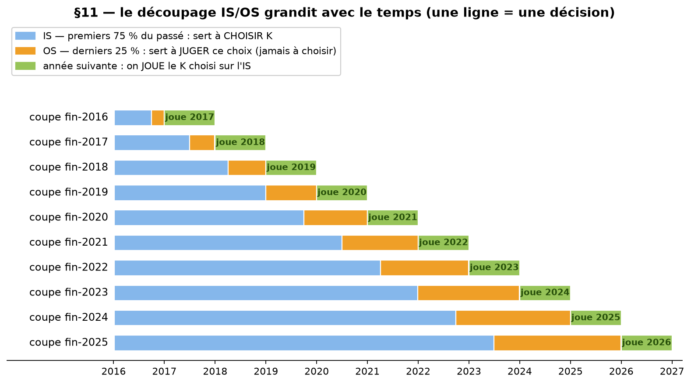
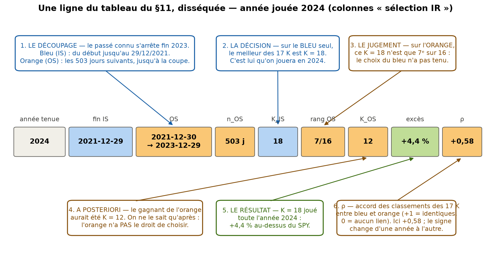

# Choisir K : le test IS/OS en une page

**La question.** Le §8 choisit chaque année le $K$ (combien de membres copier) qui a le mieux
marché sur **tout** le passé. Problème : le même passé sert à **choisir** et à **juger** — le $K$
élu a peut-être juste bien récité son examen. Le §11 teste ça.

**Le test** — chaque ligne du schéma = une décision :

- **bleu (IS, 75 % du passé)** : on y choisit $K$ — le meilleur score parmi $K = 4 \dots 20$ ;
- **orange (OS, les 25 % récents)** : jamais utilisé pour choisir. On regarde seulement quel
  **rang** le $K$ élu y fait — bon choix s'il reste en tête, hasard s'il retombe dans le paquet ;
- **vert** : on joue le $K$ élu l'année suivante (le vrai test, comme partout dans le notebook).

Le découpage grandit tout seul : 9 mois / 3 mois à la première coupe, ~6 ans / 2 ans en 2023.

**Le tableau du §11 = le journal de ces décisions** (une ligne par année jouée). La ligne « 2024 »
disséquée, case par case :

Pour lire tout le tableau d'un coup d'œil : descendre la colonne **rang OS** — si choisir $K$ sur
le passé marchait, elle serait pleine de 1/16 ; en vrai le $K$ élu retombe dans le paquet presque
à chaque fois. (Les « — » et « 1/1 » de 2016-2019 : moins de significatifs que $K$ à l'époque →
les 17 stratégies-$K$ étaient toutes identiques, rien à comparer.)

**Ce qu'on trouve — 3 faits.**

1. Le $K$ élu sur le bleu finit **mi-tableau ou pire** sur l'orange : rangs 4/5, 12/16, 10/16,
   7/16, 2/10, 10/14 (sélection IR) — jamais premier ; côté appraisal, jusqu'à **dernier (17/17)**.
2. Le $K$ gagnant de l'orange **change presque chaque année** (4, 11, 18, 12, 13, 4) : il n'existe
   pas de « bon K » stable à découvrir.
3. Le $t$ de la stratégie : **1,58** quand $K$ est choisi sur tout le passé (§8) → **1,29** quand
   il n'a droit qu'au bleu. L'écart, c'est ce que le §8 devait au fait de réviser sur l'examen.
   (Et toujours rien ne franchit le seuil $\approx 1{,}81$.)

**Conclusion.** Le meilleur $K$ du passé ne dit rien du meilleur $K$ du futur : « combien copier »
n'est **pas apprenable** sur ces données — le verdict « pas d'alpha » en sort renforcé.

*(Détails — bornes exactes des découpages, rangs par année, corrélations IS/OS, cas ex-aequo des
premières coupes : table `tab11` et figure du §11 du notebook.)*
