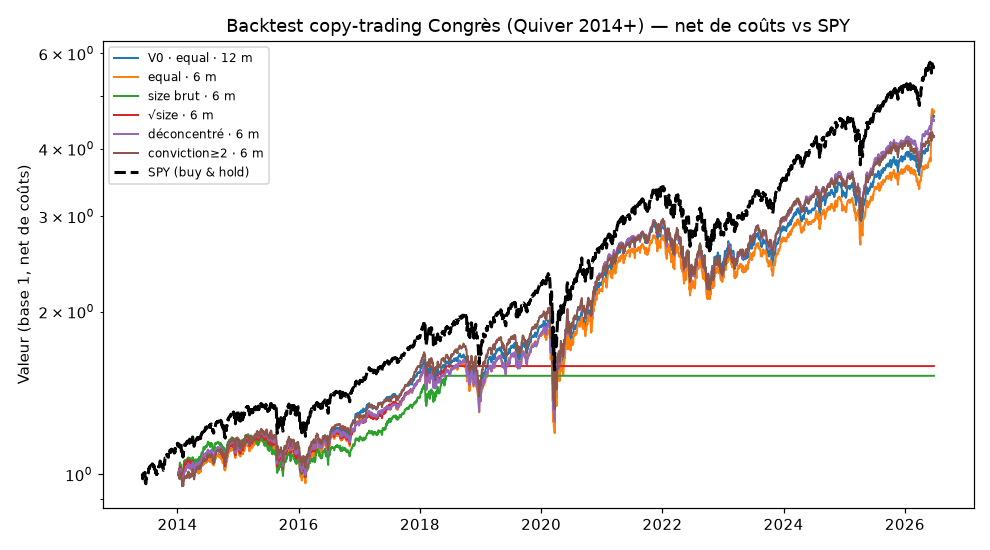

# Rapport de backtest — Copy-trading du Congrès (Quiver 2014+)
> Book de recherche **isolé** (`00. S3S4 en cours/`). Lecture seule du dépôt ; aucun fichier finalisé touché. Verdict **net de coûts**, factor-ajusté, avec Deflated Sharpe & OOS.

**Univers** : 1188 tickers (couvre **79%** des achats), 2013-06-03→2026-06-25 · coûts **20 bps** one-way · benchmark **SPY**.

## Résultats par variante
| variante | CAGR brut | CAGR net | SPY | α net vs SPY | α factoriel (t) | β mkt | Sharpe net | max DD | turnover/an | Sharpe IS→OOS | Deflated Sharpe |
|---|---|---|---|---|---|---|---|---|---|---|---|
| V0 · equal · 12 m | +14.35% | +13.02% | +13.70% | -0.68% | -0.61% (-0.6) | 0.91 | 0.79 | -35.56% | 5.9× | 0.72→0.84 | 0.98 |
| equal · 6 m | +15.25% | +13.22% | +13.70% | -0.49% | -1.12% (-1.1) | 0.92 | 0.78 | -35.64% | 8.9× | 0.69→0.86 | 0.98 |
| size brut · 6 m | +4.24% | +3.42% | +13.70% | -10.28% | -0.48% (-0.3) | 0.17 | 0.50 | -16.68% | 3.9× | 0.64→0.00 | 0.88 |
| √size · 6 m | +4.52% | +3.77% | +13.70% | -9.93% | -0.23% (-0.1) | 0.18 | 0.54 | -16.87% | 3.6× | 0.69→0.00 | 0.90 |
| déconcentré · 6 m | +14.65% | +12.85% | +13.70% | -0.85% | -0.54% (-0.6) | 0.93 | 0.78 | -34.31% | 7.9× | 0.75→0.78 | 0.98 |
| conviction≥2 · 6 m | +14.14% | +12.25% | +13.68% | -1.43% | -0.99% (-0.9) | 0.94 | 0.75 | -35.22% | 8.3× | 0.74→0.72 | 0.98 |

## Lecture
- **CAGR brut → net** : l'écart mesure le coût (turnover × bps). Le « +233 bps pré-coûts » du PoC se lit dans la colonne *CAGR brut* vs *SPY*.
- **α factoriel (t)** : alpha après contrôle Fama-French-Carhart (marché, taille, value, momentum). C'est le vrai test : si l'« alpha » brut n'est que du **beta** (β mkt > 1, tilt tech), l'α factoriel s'effondre vers 0 et `t` devient non significatif (|t| < 2).
- **Deflated Sharpe** (López de Prado) : probabilité que le Sharpe soit réel compte tenu du nombre de variantes essayées. **< 0,95 ⇒ non concluant** (compatible avec la chance).
- **Sharpe IS→OOS** : effondrement = sur-apprentissage (la non-persistance attendue).

## Verdict
**Aucune variante ne dégage d'alpha factoriel significatif** (tous |t| < 1,2). L'equal-weight ≈ le marché (β ≈ 0,9) et perd légèrement net après coûts ; le size brut/√size s'effondrent (concentration sur quelques méga-trades, Sharpe OOS → 0) ; **la conviction-cluster et la dé-concentration n'aident pas**. Et c'est un **plancher optimiste** (312 tickers délistés exclus → survivorship haussier). → **Pas d'edge net exploitable** par une stratégie de copy-trading « suivre le Congrès » sur 2014-2026. Conforme à la littérature post-STOCK Act et aux ETF réels (NANC ≈ marché). La valeur d'un produit « Congrès » est la **data/transparence**, pas l'alpha.

*(Premier jet — univers limité aux tickers à prix yfinance ⇒ biais survivorship résiduel haussier ; voir `STRATEGIE_ANALYSE.md`. Non testé ici : variante leadership/chairs et niche défense micro-caps — sourcing supplémentaire.)*
