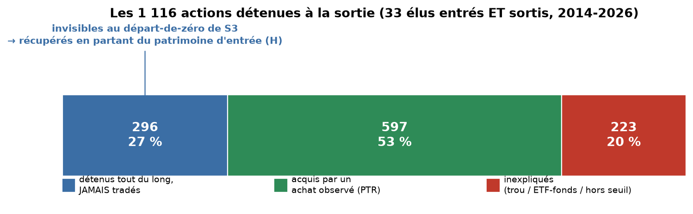

# Reconstruire le portefeuille : entrée (H) + transactions (P) → sortie (T)

> Branche `presentation` · 2026-07-12 · Chambre uniquement · **preuve de concept**.
> Idée d'Alice : le portefeuille d'un élu = **ce qu'il détient en entrant** (rapport H,
> Schedule A) **+ toutes ses transactions** (PTR) au fil du mandat ; quand il sort, on
> doit **retomber sur ce qu'il détient à la sortie** (rapport T, Schedule A). Si oui →
> preuve qu'on a bien capté toutes les transactions ; sinon → on chiffre ce qui manque.

## 1. Pourquoi c'est important (et nouveau)

La reconstruction de portefeuille actuelle de S3 (`05b_Portefeuille_Membre_MathSpec.ipynb`,
`member_shares`) **part de zéro** : les parts détenues sont initialisées à 0 pour chaque
titre, et une vente est plafonnée à ce qui a été **acheté dans la fenêtre** (pas de
position négative). Conséquence : **un titre détenu avant les données, ou jamais tradé,
est invisible.** Le patrimoine détenu (Schedule A) n'avait jamais été extrait — c'est fait
ici pour la première fois (PoC).

## 2. Ce qu'on a fait

- **Nouveau parseur Schedule A** (holdings tickérisés) : sur les rapports H (entrée) et T
  (sortie) numériques déjà en local — **57 890 lignes de patrimoine** extraites de 2 621
  documents. Validé contre les PDF ouverts (Axne, Pelosi, Amo : tickers et fourchettes
  concordants).
- **Cohorte de cohérence** : les élus ayant **un H (entrée) ET un T (sortie)** dans la
  fenêtre 2014-2026 = **37 membres**, dont **33 exploitables** (dates cohérentes, sortie
  non vide). Bornes = dates de dépôt du H et du T (pas besoin des mandats YAML).
- **Reconstruction, au niveau présence/direction** (les montants sont des fourchettes, pas
  des quantités) : sortie prédite = entrée ∪ achats − ventes ; comparée à la sortie réelle
  (Schedule A du T).

## 3. Résultat

Sur les **1 116 actions/ETF détenues à la sortie** par ces 33 élus :

| | actions de sortie | part |
|---|---:|---:|
| **acquises par un achat observé (PTR)** | 597 | **53 %** |
| **détenues tout du long, jamais tradées** (dans l'entrée, aucun achat) | 296 | **27 %** |
| inexpliquées (ni entrée ni achat) | 223 | 20 % |
| **cohérence globale** (entrée + transactions expliquent la sortie) | **893** | **80,0 %** |

- Pour les seuls **traders actifs** (≥ 5 PTR, 20 membres) : **81,2 %** de cohérence.
- **80 % du portefeuille de sortie se reconstruit** à partir de l'entrée et de nos
  transactions → validation forte de la complétude du flux PTR sur cette cohorte.

**Le chiffre qui valide l'intuition d'Alice** : **27 % des positions de sortie sont
détenues tout du long sans jamais être tradées** — donc **totalement invisibles** à la
reconstruction « départ de zéro » de S3. Partir du patrimoine d'entrée (H) les récupère.

**Exemple vérifiable** — Marjorie Taylor Greene détient **BMY** (Bristol-Myers) et **MCD**
(McDonald's) à 1 001–15 000 \$ dans son [rapport d'entrée H 2020](https://disclosures-clerk.house.gov/public_disc/financial-pdfs/2020/10042733.pdf)
**et** dans son [rapport de sortie/dernier T 2026](https://disclosures-clerk.house.gov/public_disc/financial-pdfs/2026/10073322.pdf),
avec **zéro PTR** sur BMY : détenu tout du long, jamais tradé.

## 4. Ce que révèlent les 20 % inexpliqués (honnêteté)

Les 223 actions « inexpliquées à la sortie » (achats manquants) se répartissent ainsi
(annexe `coherence/annexe_coherence_trous.csv`) :

| nature | n |
|---|---:|
| action cotée | 113 |
| ETF | 45 |
| « inconnu » (coté non résolu) | 64 |
| fonds mutuel | 1 |

Trois causes, non exclusives :
1. **Détenu avant l'entrée mais absent de notre snapshot d'entrée** (H incomplet, ou parseur
   qui rate une ligne) — pas un vrai trou de transaction.
2. **ETF/fonds détenus mais non tradés en PTR** (légitime : ces instruments ne font pas
   toujours l'objet d'un PTR) — ~90 des 223.
3. **Vrai trade jamais déposé en PTR** — cohérent avec le trou déjà chiffré
   (`ANALYSE_FILING_TYPES_HOUSE.md` : ~100 actions annuel-seul, toutes 2014-2017).

Les 550 « ventes manquantes » (titre d'entrée disparu sans vente observée) sont dominées
par l'effet du **seuil de déclaration de 1 000 \$** (une petite position sort de la
Schedule A sans transaction) — métrique bruitée, peu diagnostique.

**Découverte de complétude** : **9 des 33 membres n'ont quasiment aucun PTR** (Porter,
Wild, Bourdeaux, Ferguson, Molinaro, Mucarsel-Powell, Pence, Steel + 1) — 0 transaction
dans notre corpus, alors qu'ils **détiennent des actions**. Pour eux, la Schedule A des
rapports H/T est **la seule fenêtre** sur le portefeuille — le flux PTR est vide. C'est
précisément le cas d'usage du patrimoine détenu.

## 5. Limites (assumées)

- **Présence/direction, pas quantité** : fourchettes, pas de nombre de titres → on valide
  la présence et le sens, pas les volumes.
- **Seuil 1 000 \$** : petites positions invisibles (fausses « ventes manquantes »).
- **Filtre fonds imparfait** : seuls les fonds mutuels « XXXX + X » sont écartés ; des ETF
  passent en « action » (d'où une partie des 223).
- **Cohorte = 33 membres** avec H+T numériques en fenêtre ; forte sur ce sous-ensemble,
  pas représentative de tous les élus. Les **rapports scannés** (H/T 2014-2016) ne sont
  pas encore OCRisés → cohorte élargissable.
- Propriété conjoint/enfant et blind trusts non désambiguïsés finement.

## 6. Verdict & suite

**La reconstruction entrée → transactions → sortie fonctionne** (80 % de cohérence) et
prouve deux choses : (i) notre flux de transactions est largement complet pour les traders
actifs ; (ii) **le patrimoine d'entrée est indispensable** — 27 % des positions n'existent
que par lui, et 9 membres n'ont que ça. C'est la brique qui manque à S3.

**Si on industrialise** (hors PoC) : module versionné `house/holdings.py` +
`HOUSE_HOLDINGS_SCHEMA` (`common/schema.py`) + `SCHEDULE_A_VALUE_MAP` (`house/amounts.py`) ;
OCR des ~1 182 H/T/O scannés (budget API sondé d'abord — élargit surtout 2014-2016) ;
puis **seeder `member_shares` de S3 avec le patrimoine d'entrée** pour corriger le
départ-de-zéro. Sur une branche dédiée `holdings`, pas `presentation`.

## Annexes

- `coherence/annexe_coherence_membres.csv` — les 33 membres, dates entrée/sortie, nb
  d'holdings entrée/sortie, transactions, expliqués, trous, taux.
- `coherence/annexe_coherence_trous.csv` — les 773 trous (achat/vente manquant) ligne à
  ligne (membre, ticker, sortie).
- `coherence/fig_coherence.png`.
- Reproduction : parseur Schedule A + cohorte + réconciliation (scripts d'analyse en
  session, non committés — règle « pas de .py de support »).
