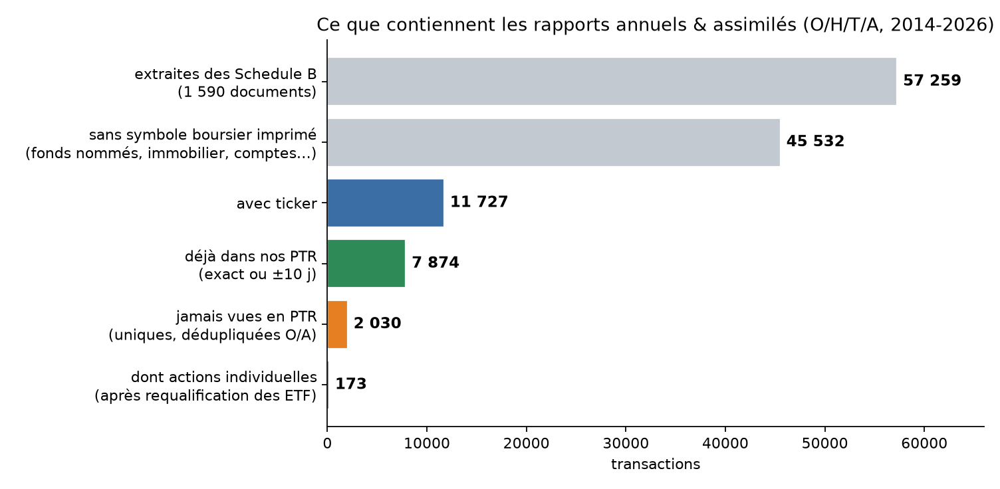
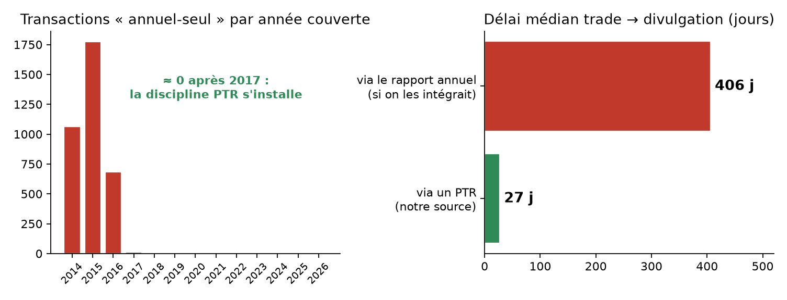

# Les 12 types de dépôts de la Chambre — que rate-t-on en ne prenant que les PTR ?

> Branche `presentation` · 2026-07-12 · périmètre : **Chambre uniquement**.
> Question : le pipeline ne récupère que les dépôts `FilingType = P` (8 252 PTR sur
> 35 315 dépôts listés par les index du Clerk 2014-2026). **Les 27 063 autres dépôts
> contiennent-ils des transactions qui nous manquent ?**
> Méthode : chaque type a été **ouvert et lu** (liens ci-dessous), puis les 5 779
> rapports numériques à transactions potentielles (types O/H/T/A des membres) ont été
> **téléchargés et parsés intégralement** (Schedule B), et leurs 57 259 transactions
> **réconciliées ligne à ligne** contre notre corpus PTR.

## 1. Réponse en bref

- Les rapports annuels & assimilés (O/H/T/A) contiennent bien des transactions :
  **57 259 lignes** dans leurs « Schedule B ». Mais :
  - **79,5 %** n'ont **pas de symbole boursier** (fonds nommés, comptes, immobilier, non-coté) ;
  - parmi les **11 727 tickérisées** : **67,1 % sont déjà dans nos PTR** (date exacte ou ±10 j) ;
  - les **2 030 uniques jamais vues en PTR** sont à ~2/3 des **fonds mutuels et ETF**
    — catégorie qui, en pratique, **ne fait pas l'objet de PTR** (constat empirique
    massif : Gutierrez 927 lignes de fonds/ETF, 0 PTR correspondant) ;
  - le reliquat en **actions individuelles : 173 trades sur 13 ans** (0,11 % du corpus
    House), **concentré 2014-2017** (64+67+38+4) puis **zéro** — la discipline PTR
    s'installe après les débuts du STOCK Act ;
  - surtout : ces transactions ne deviennent publiques qu'au dépôt du rapport annuel —
    **délai médian trade → divulgation : 406 jours** (contre 27 j via PTR). Même
    intégrées, elles seraient **inexploitables pour une stratégie datée** (anti-look-ahead).

**Verdict global : le filtre `P` est le bon choix pour le signal copy-trading.**
Le « manque » est réel mais (i) massivement hors-actions, (ii) résiduel et pré-2017
pour les actions, (iii) structurellement trop tardif pour être tradé. Il doit en
revanche être **documenté comme limite** (fait ici), et les annuels restent une
**option « vue patrimoine »** si un besoin futur le justifie.

## 2. L'univers des 12 types — chacun ouvert et vérifié

Répartition des 35 315 dépôts 2014-2026 (index `{année}FD.xml`), signification
**vérifiée en ouvrant les documents** (le champ « Filing Type » est imprimé dedans),
un lien réel par type :

| Code | Nom (vérifié dans le document) | Dépôts | % membres¹ | Transactions ? | Exemple réel |
|---|---|---:|---:|---|---|
| **P** | **Periodic Transaction Report** | **8 252** | 99 % | **oui — notre source** | [Allen 2023](https://disclosures-clerk.house.gov/public_disc/ptr-pdfs/2023/20022986.pdf) |
| C | Candidate Report | 10 105 | 23 % | Schedule B possible | [Hollier 2023](https://disclosures-clerk.house.gov/public_disc/financial-pdfs/2023/10056211.pdf) |
| X | Extension Request | 5 844 | 64 % | non (demande de délai) | [Abid 2023](https://disclosures-clerk.house.gov/public_disc/financial-pdfs/2023/30019473.pdf) |
| O | Annual Report | 4 625 | 98 % | **oui — Schedule B** | [Adams 2023](https://disclosures-clerk.house.gov/public_disc/financial-pdfs/2023/10059952.pdf) |
| A | Amendment Report | 2 298 | 72 % | oui (corrige O/C/H/T) | [Albertson-Corkery 2023](https://disclosures-clerk.house.gov/public_disc/financial-pdfs/2023/10062190.pdf) |
| D | Campaign Notice (numérique) | 2 196 | 17 % | non (< 5 000 $ levés) | [Abel 2023](https://disclosures-clerk.house.gov/public_disc/financial-pdfs/2023/40003491.pdf) |
| W | Campaign Notice / retrait (papier) | 1 099 | 16 % | non | [Atkinson 2023](https://disclosures-clerk.house.gov/public_disc/financial-pdfs/2023/8219940.pdf) |
| H | New Filer Report | 395 | 97 % | oui — Schedule B | [Amo 2023](https://disclosures-clerk.house.gov/public_disc/financial-pdfs/2023/10062638.pdf) |
| T | Terminated Filer Report | 392 | 99 % | oui — Schedule B | [Axne 2023](https://disclosures-clerk.house.gov/public_disc/financial-pdfs/2023/10050798.pdf) |
| G | Gift Disclosure Waiver Request | 51 | 98 % | non (dérogation cadeau) | [Auchincloss 2023](https://disclosures-clerk.house.gov/public_disc/financial-pdfs/2023/8219737.pdf) |
| E | Terminated Employee Filing Exemption | 35 | 97 % | non | [Budd 2023](https://disclosures-clerk.house.gov/public_disc/financial-pdfs/2023/8219324.pdf) |
| B | Blind Trust (courrier du gestionnaire) | 23 | 100 % | oui, mais **non dirigées par l'élu** | [Phillips 2023](https://disclosures-clerk.house.gov/public_disc/financial-pdfs/2023/8219364.pdf) |

¹ % des dépôts dont le déposant matche le référentiel congress-legislators (membres,
actuels ou passés). URLs : `P` → dossier `ptr-pdfs/`, tous les autres → `financial-pdfs/`
(vérifié par sonde HTTP sur 2 exemplaires de chaque type : 24/24 en 200).

Corrections notables vs libellés « supposés » antérieurs : **Annual = O** (pas A),
**Termination = T** (pas W), **A = Amendment**, **H = New Filer**, **D/W = Campaign
Notice**, **E = exemption**, **G = dérogation cadeau**, **B = blind trust**.

## 3. Méthode de la mesure

1. **Recensement** : parsing des 13 index → 35 315 dépôts, croisés avec le référentiel
   congress-legislators (membre vs candidat) et la forme du DocID
   (8 chiffres en `1…`/`2…`/`3…`/`4…` = numérique ; `7…`/`8…`/`9…` = scanné).
2. **Cible** : les types à Schedule B déposés par des **membres** : O/H/T/A =
   **6 961 documents**, dont **5 779 numériques** → **tous téléchargés** (0 échec).
3. **Parsing** : extraction de la section « Schedule B: Transactions » de chacun
   (actif, ticker, date, sens P/S/E, fourchette) → **57 259 transactions**
   (1 590 documents en contiennent ; validation du parseur sur cas connus —
   les 5 trades de l'annuel 2015 de Pelosi ressortent tous, delta 0 jour).
4. **Réconciliation** contre le corpus House complet (151 989 lignes uniques,
   mêmes réparations read-time que le pipeline) par clé
   (nom, initiale, ticker, sens) : date exacte → ±10 j → ±90 j → aucun match.
   Les répétitions O/A d'un même trade sont dédupliquées.
5. **Requalification** des « aucun match » : fonds mutuels (5 lettres finissant
   par X), ETF (carte `ticker_sector_map` + nom d'émetteur iShares/SPDR/Vanguard/…),
   reliquat = actions individuelles.

Non couverts par la mesure : les **1 182 O/H/T/A scannés** (2014-2016 surtout — le
trou actions y est donc légèrement sous-estimé, même ordre de grandeur attendu) et
les 45 532 lignes **sans ticker** (fonds nommés sans symbole, non réconciliables
automatiquement — même nature que le « sans_ticker » de nos PTR).

## 4. Résultats détaillés

| Mesure | Valeur |
|---|---:|
| Transactions Schedule B extraites (O/H/T/A numériques, membres) | 57 259 |
| — sans symbole boursier imprimé | 45 532 (79,5 %) |
| — avec ticker | 11 727 |
| — déjà dans nos PTR (exact / ±10 j) | 7 874 (**67,1 %**) |
| — à ±90 j / hors fenêtre | 59 / 256 |
| — jamais vues en PTR (brut → dédupliqué O/A) | 3 538 → **2 030** |
| — dont fonds mutuels / ETF / non-coté « inconnu » | 641 / 530+122 / 564 |
| — dont **actions individuelles** | **173** |
| Années des 2 030 « annuel-seul » | 2014-2016 : 99,6 % · ≥2018 : 0 |
| Délai médian trade → dépôt du rapport (annuel-seul) | **406 j** (P25 292 · P75 526) |
| Délai médian via PTR (rappel) | 27 j |

Lecture : le seul « gisement » significatif jamais couvert par les PTR est constitué
de **fonds mutuels et d'ETF** — précisément les instruments qu'un élu peut détenir
sans obligation pratique de PTR — plus un **résidu d'actions des années 2014-2016**
(discipline STOCK Act naissante ; ex. E. Cantor, Termination 2014 ; L. Gutierrez,
gros investisseur en fonds : 927 lignes annuelles, 23 PTR seulement).
Les membres concernés **ne sont pas absents de notre collecte** (tous ont des PTR
chez nous) : c'est le dépôt du PTR qui n'a jamais eu lieu côté élu.

## 5. Verdicts, type par type

| Type | Verdict pour la couche données | Pourquoi |
|---|---|---|
| **P** | **Source principale — inchangé** | seul rapport daté au trade, divulgué ~27 j |
| O, H, T, A | **Ne pas intégrer au signal** ; documenté comme limite | 67 % redondants ; le reste = fonds/ETF exemptés + 173 actions pré-2017 ; divulgation à 406 j = inexploitable anti-look-ahead |
| B (blind trust) | **Hors signal** (flag possible si besoin) | transactions non dirigées par l'élu — c'est le principe même du blind trust |
| C (candidats) | **Hors périmètre** | 77 % de candidats jamais élus ; trades pré-mandat sans accès à l'information parlementaire |
| X, D, W, E, G | **Ignorer définitivement** | purement administratifs, aucune transaction |

**Option future (« vue patrimoine »)** : si un jour on veut le patrimoine complet des
élus (Schedule A des annuels) ou les transactions de fonds, le socle est prêt :
recensement, URLs, parseur Schedule B validé, réconciliation. Toute ingestion devrait
porter `source_type` + `flag_disclosure_annual` (divulgation imprécise à l'année).

## 6. Annexes

- [`data/filing_types/annexe_trou_annuel_seul.csv`](data/filing_types/annexe_trou_annuel_seul.csv)
  — les 2 030 transactions tickérisées « annuel-seul » (dédupliquées), ligne à ligne.
- [`data/filing_types/annexe_trou_actions.csv`](data/filing_types/annexe_trou_actions.csv)
  — la sous-liste « actions » avant requalification manuelle des ETF (295 lignes,
  dont 122 ETF au nom explicite → 173 actions individuelles).
- Figures : `data/filing_types/fig_entonnoir_schedb.png`, `data/filing_types/fig_trou_annee_delai.png`.
- Reproduction : recensement + téléchargement (5 779 PDF, ~40 min) + parsing Schedule B
  + réconciliation contre les tables FINAL — scripts d'analyse exploratoire exécutés
  en session (non committés, conformément à la règle « pas de .py de support ») ;
  la méthode complète est décrite §3 et les sorties intermédiaires sont les annexes.
