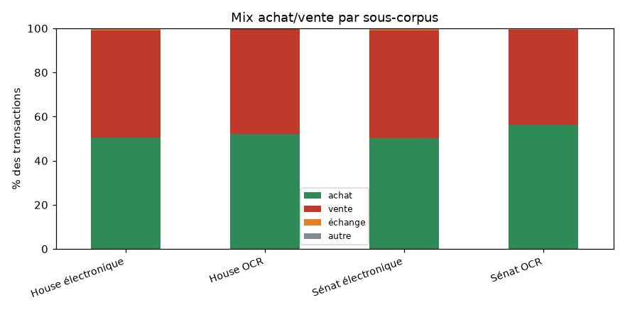
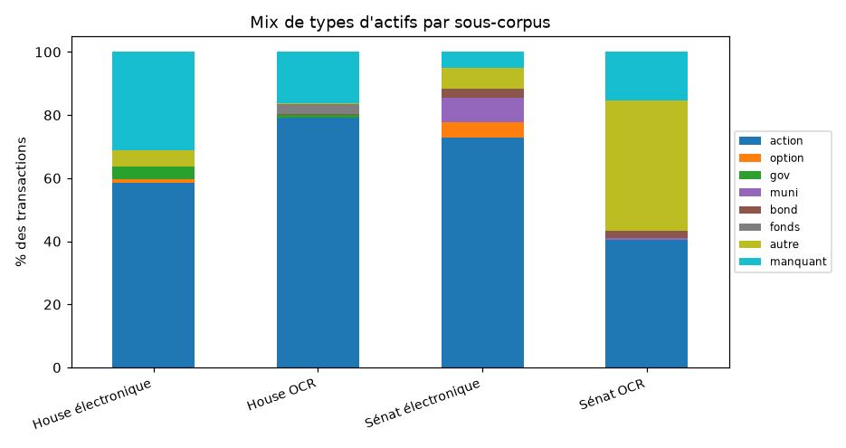
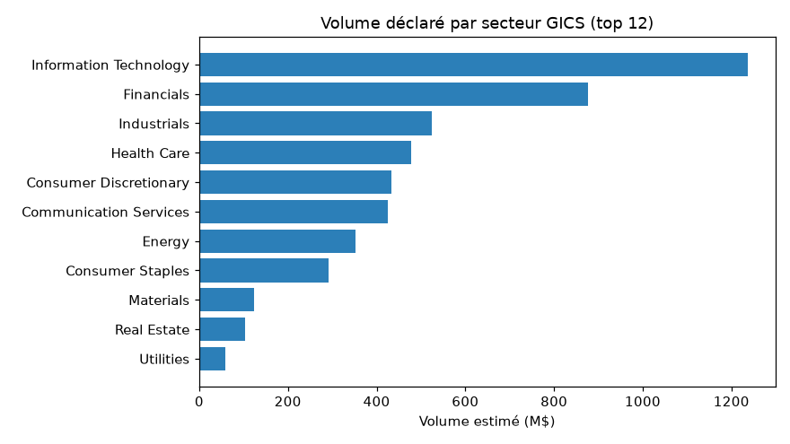
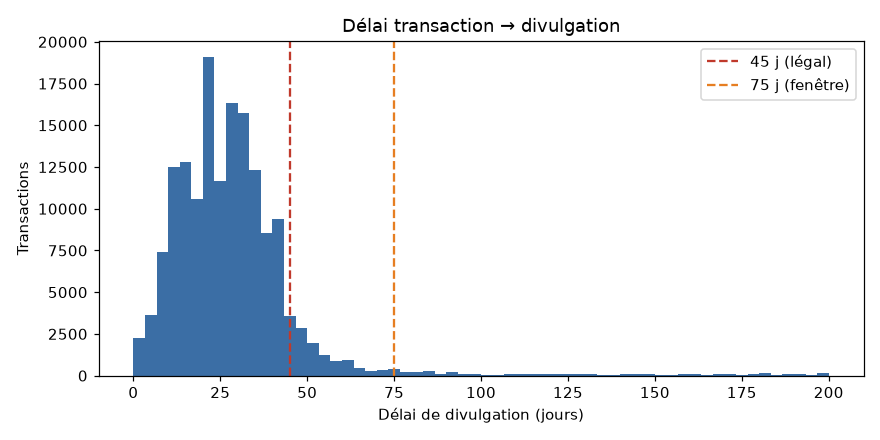
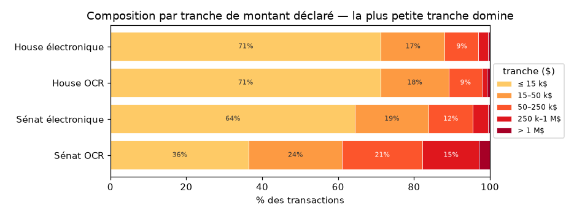
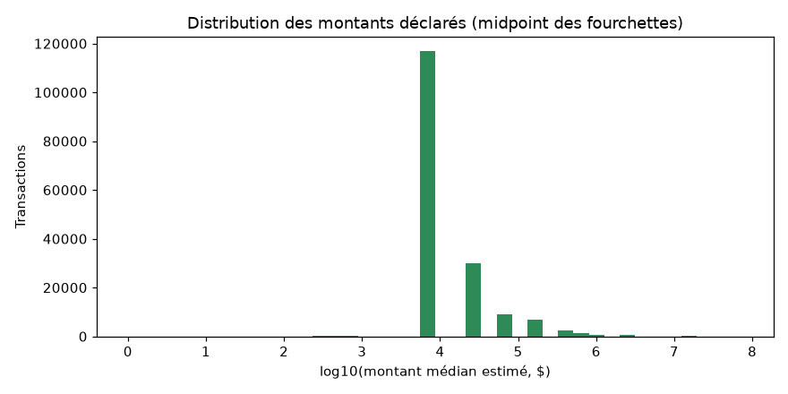
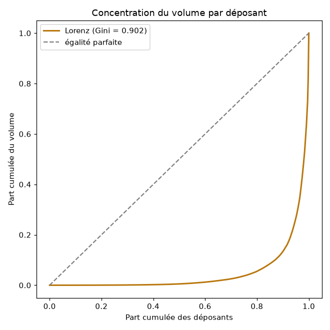
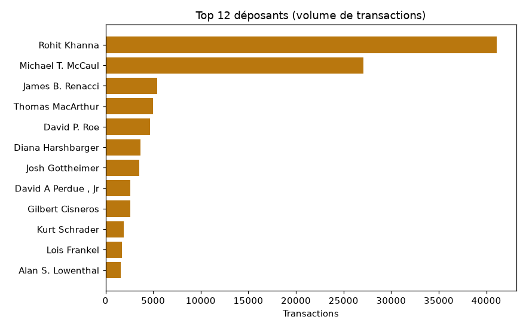
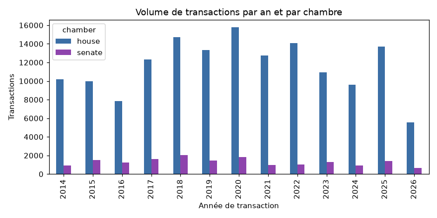
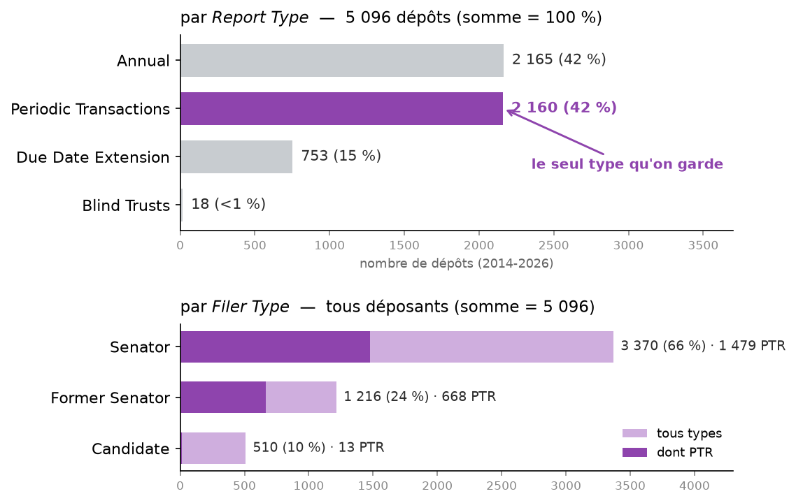

# Rapport des données — trading du Congrès américain
> Chambre des représentants + Sénat · 2014–2026 · **régénéré le 2026-08-11** par `python -m common.quality` — relancer le pipeline régénère ce rapport : si les données changent, chaque chiffre suit (lecture seule des tables FINAL, aucun appel API) · Quiver Quantitative = vérité-terrain externe, **jamais réinjectée**. *Les % sont arrondis à 0,1 pt ; une somme de colonnes peut afficher 100,1.*

## Résumé exécutif

**En un clin d'œil** :

| | |
|---|---|
| Transactions uniques (2 chambres, 2014–2026) | **169 000** (House 151 989 · Sénat 17 011) |
| Couverture de l'univers officiel (index House Clerk) | **100 %** des 8 252 PTR traités |
| Identité rattachée (bioguide) | **100.0 %** (367 membres House · 78 Sénat) |
| Dates cohérentes / délai médian de divulgation | **99.8 %** / **27 j** |
| Montants renseignés | **99.4 %** |
| Combinaisons Quiver retrouvées (déposant, ticker, sens — fenêtre commune) | **93.5 %** House · **92.1 %** Sénat |
| Table de recherche backtest (§7) | **134 452 lignes × 39 colonnes** |
| Filet de non-régression | golden **230 + 138 fichiers** (SHA256), zéro écart |

- **Périmètre** — 169 000 transactions uniques de membres élus (House 151 989 + Sénat 17 011), 2014–2026, en **4 sous-corpus** (chambre × voie d'acquisition : électronique déterministe / scan OCR).
- **Complétude vs Quiver** *(§6)* — dans notre fenêtre, on retrouve **93.5 % (House) / 92.1 % (Sénat)** des trades Quiver au niveau (déposant, ticker, sens). Le **trou coté est minuscule** — ≤ 31 House / 0 Sénat au niveau ticker (borne haute) ; une mesure COMPLÉMENTAIRE au trade daté (§6.5, clé différente — les deux comptes ne s'emboîtent pas) confirme **27 House / 11 Sénat vrais trous** ; le reste du résidu est de l'OCR récupérable ou du hors-périmètre.
- **On est plus complet que Quiver** — **+26 524 combinaisons cotées (déposant, ticker, sens)** qu'on a et que Quiver n'a pas, contre 38 trous inverses → **sur-ensemble** de Quiver. ⚠ Cette avance est **inégale dans le temps** : bien corroborée après ~2017, elle repose avant sur des trades réels que **Quiver (mince pré-2017) ne peut pas confirmer** — détail par année en §6.2.
- **Les « écarts » de date ne sont pas des erreurs** — la réconciliation 1-à-1 (§6.3) montre que l'essentiel est du « nous-seul » (Quiver n'a pas le trade) ; seuls 545 candidats House (même déclaration) méritent l'œil, et le vrai contrôle des dates reste l'audit PDF (§3).
- **Données propres** — identité rattachée à 100.0 %, dates cohérentes 99.8 %, délai de divulgation médian 27 j, montants renseignés 99.4 %. *Anti-look-ahead : tout usage aval (backtest) entre sur `disclosure_date` (date de dépôt imprimée, fiable), jamais sur la `transaction_date` OCR — quelques dates OCR restent imprécises (§3).*

*Plan : §1 construction & validation · §2 composition & complétude · §3 qualité des dates · §4 montants · §5 activité & concentration · §6 complétude vs Quiver (vérité-terrain) · §7 du corpus à la table de recherche (nettoyage backtest) · §8 corroboration externe ligne à ligne (SSW/HSW) · §9 le papier Sénat · §10 les types de dépôts Sénat.*

## 1. Construction & validation du corpus

Avant toute statistique, voici **comment le corpus est construit**, dans l'ordre :

1. **Sources** — déclarations officielles : Chambre (*PTR — Periodic Transaction Report*) et Sénat (*eFD — electronic Financial Disclosure*), chacune en deux voies — **électronique** (formulaire structuré, lecture déterministe) et **papier scanné** (PDF → **OCR** par modèle de vision).
2. **Extraction** — une ligne = une transaction (membre, date, actif, sens, fourchette de montant, détenteur).
3. **Enrichissement** — ticker (explicite dans la source · repris de l'électronique · résolu par LLM), secteur GICS (yfinance · LLM), identité (`bioguide_id`), ancienneté.
4. **Déduplication cross-année** — une même transaction re-divulguée une autre année (amendement, rapport annuel) ne compte qu'**une fois** (clé naturelle + rang d'occurrence).

**Réconciliation — des lignes brutes aux transactions uniques** (c'est notre corpus, pas Quiver) :

| chambre | lignes brutes | re-divulgations (dédup) | transactions uniques |
| --- | --- | --- | --- |
| house | 152081 | 92 | 151989 |
| senate | 18839 | 1828 | 17011 |
| TOTAL | 170920 | 1920 | 169000 |
*lignes brutes = FINAL concaténé 2014–2026 · re-divulgations = doublons cross-année retirés · transactions uniques = le corpus analysé dans tout ce rapport*

### Couverture vs l'univers officiel (House Clerk)

Chaque index annuel `{Y}FD.xml` du Clerk liste TOUS les dépôts de l'année ; les PTR ont `FilingType='P'`. **L'index annuel est l'autorité d'appartenance** d'un document à son année : un PTR déposé tardivement (jusqu'à +3 ans après l'année du formulaire) reste rattaché à son index. **100 % des PTR officiels sont traités** — parsés, OCRisés, ou écartés par une règle écrite (manuscrits, cf. §6.6).

| année | PTR officiels | avec transactions | gated manuscrit | sans txn retenue | couverts % |
| --- | --- | --- | --- | --- | --- |
| 2014 | 708 | 613 | 94 | 1 | 100.0 |
| 2015 | 728 | 627 | 97 | 4 | 100.0 |
| 2016 | 765 | 651 | 110 | 4 | 100.0 |
| 2017 | 801 | 708 | 82 | 11 | 100.0 |
| 2018 | 830 | 752 | 68 | 10 | 100.0 |
| 2019 | 683 | 616 | 52 | 15 | 100.0 |
| 2020 | 733 | 688 | 35 | 10 | 100.0 |
| 2021 | 680 | 653 | 15 | 12 | 100.0 |
| 2022 | 624 | 602 | 14 | 8 | 100.0 |
| 2023 | 460 | 447 | 2 | 11 | 100.0 |
| 2024 | 451 | 440 | 5 | 6 | 100.0 |
| 2025 | 515 | 503 | 6 | 6 | 100.0 |
| 2026 | 274 | 268 | 2 | 4 | 100.0 |
| TOTAL | 8252 | 7568 | 582 | 102 | 100.0 |
*PTR officiels = FilingType='P' de l'index du Clerk · avec transactions = docs présents dans le FINAL de l'année · gated manuscrit = cluster C du census hors exceptions (politique §6.6, listes rejouables) · sans txn retenue = vides réels (« nothing to report »), amendements sans lignes ou échecs documentés (`05_parse_failures`). Sénat : pas d'index public re-vérifiable sans re-scraping eFD — le census interne fait foi (25 dépôts sans transaction tous motivés dans `06d_docs_sans_transaction.csv`) ; la part des PTR dans le portail eFD : §10.*

### Validation & reproductibilité

Tout est **rejouable hors-ligne** (lecture seule des tables FINAL, **0 appel API**), adossé à trois filets automatiques :

- **Golden octet-à-octet** — 368 tables CSV figées par SHA256 (230 House + 138 Sénat), rejouées à **zéro écart** (`tests/regression/check_golden.py`, `senate_check_golden.py`).
- **Invariants porteurs** — pour chaque chambre `digital + OCR = FINAL`, identité rattachée à **100.0 %**, 367 bioguides (House) / 78 (Sénat) recomptés par ce rapport (corrections read-time incluses ; les invariants des FINAL crus sont verrouillés par `tests/regression/audit_metrics.py`).
- **Transformations déterministes** — 9 tests reproduisent chaque étape (clé naturelle, montants, tickers, identité, ancienneté, cache Vision) depuis les colonnes figées.

### Les quatre sous-corpus

Toute la suite distingue **quatre familles** (chambre × voie), car leur qualité et leur composition diffèrent :

| sous-corpus | n | part % |
| --- | --- | --- |
| House électronique | 58728 | 34.8 |
| House OCR | 93261 | 55.2 |
| Sénat électronique | 13026 | 7.7 |
| Sénat OCR | 3985 | 2.4 |
*sous-corpus = chambre × voie (électronique déterministe / scan OCR) · n = transactions uniques · part % du total*

## 2. Composition & complétude

**Ce que contient le corpus** (opérations, détenteur, familles d'actifs), puis **à quel point les champs sont remplis**.

### Sens des opérations

| sous-corpus | n | achat % | vente % | échange % | autre % |
| --- | --- | --- | --- | --- | --- |
| House électronique | 58728 | 50.4 | 48.6 | 1.0 | 0.0 |
| House OCR | 93261 | 52.2 | 47.3 | 0.5 | 0.0 |
| Sénat électronique | 13026 | 50.2 | 48.8 | 1.0 | 0.0 |
| Sénat OCR | 3985 | 56.4 | 43.0 | 0.6 | 0.0 |
*achat = `operation_type` contient « Purchase » · vente = contient « Sale » (**inclut Sale (Partial) et (Full)**) · échange = « Exchange » · autre = reste*



### Détenteur déclaré

| sous-corpus | n | perso % | conjoint % | joint % | enfant % | autre % |
| --- | --- | --- | --- | --- | --- | --- |
| House électronique | 58728 | 49.3 | 20.4 | 26.7 | 3.6 | 0.0 |
| House OCR | 93261 | 10.3 | 47.9 | 13.6 | 28.2 | 0.0 |
| Sénat électronique | 13026 | 16.8 | 38.7 | 42.1 | 2.4 | 0.0 |
| Sénat OCR | 3985 | 48.8 | 49.5 | 1.5 | 0.3 | 0.0 |
*titulaire du compte : perso = Self · conjoint = Spouse/SP · joint = Joint/JT · enfant = Dependent/Child/DC · autre = reste ou non déclaré*

### Familles d'actifs

L'OCR du Sénat se distingue : la part d'actions y tombe et la catégorie « autre » (essentiellement du non-coté : parts de sociétés privées, produits divers) domine :

| sous-corpus | n | action % | option % | oblig. État % | muni % | oblig. corp. % | fonds % | autre % | manquant % |
| --- | --- | --- | --- | --- | --- | --- | --- | --- | --- |
| House électronique | 58728 | 58.5 | 1.2 | 4.1 | 0.0 | 0.0 | 0.0 | 4.9 | 31.3 |
| House OCR | 93261 | 79.2 | 0.0 | 0.8 | 0.0 | 0.4 | 3.2 | 0.3 | 16.2 |
| Sénat électronique | 13026 | 73.0 | 4.7 | 0.0 | 7.7 | 3.0 | 0.0 | 6.5 | 5.1 |
| Sénat OCR | 3985 | 40.4 | 0.0 | 0.0 | 0.7 | 2.2 | 0.0 | 41.2 | 15.5 |
*familles d'`asset_type` : action = Stock · option · oblig. État = Gov/Treasury · muni = Municipal · oblig. corp. = Bond · fonds = Fund/ETF · manquant = vide*



### Couverture des champs enrichis (taux de remplissage)

| sous-corpus | n | ticker % | secteur % | ETF % | commission % | identité % | ancienneté % | montant renseigné % |
| --- | --- | --- | --- | --- | --- | --- | --- | --- |
| House électronique | 58728 | 83.8 | 77.7 | 77.7 | 54.8 | 100.0 | 100.0 | 100.0 |
| House OCR | 93261 | 84.3 | 81.1 | 81.1 | 80.8 | 100.0 | 99.9 | 98.9 |
| Sénat électronique | 13026 | 84.1 | 77.8 | 77.8 | 53.0 | 100.0 | 99.9 | 100.0 |
| Sénat OCR | 3985 | 57.4 | 46.2 | 46.2 | 64.9 | 100.0 | 100.0 | 99.4 |
*% de lignes où le champ est renseigné · identité = rattachée à un `bioguide_id` · montant renseigné = `amount_midpoint` non vide · ticker/secteur/ETF vides = actif non coté (normal, pas un défaut)*

### Secteurs & origine des champs résolus

| sous-corpus | n | secteur renseigné % | ETF % | top 3 secteurs |
| --- | --- | --- | --- | --- |
| House électronique | 58728 | 77.7 | 77.7 | Information Technology 18%, Financials 14%, Health Care 13% |
| House OCR | 93261 | 81.1 | 81.1 | Information Technology 17%, Financials 15%, Health Care 13% |
| Sénat électronique | 13026 | 77.8 | 77.8 | Information Technology 19%, Financials 14%, Health Care 11% |
| Sénat OCR | 3985 | 46.2 | 46.2 | Financials 16%, Industrials 15%, Health Care 12% |
*secteur renseigné % / ETF % = taux de remplissage (vide = non coté) · top 3 = secteurs GICS dominants*

**Origine du ticker** (`ticker_source`) :

| sous-corpus | n | dico élec % | LLM % | nom d'actif % | récupéré % | explicite % | aucune % |
| --- | --- | --- | --- | --- | --- | --- | --- |
| House électronique | 58728 | 0.0 | 0.0 | 0.0 | 3.2 | 80.5 | 16.2 |
| House OCR | 93261 | 35.9 | 40.2 | 0.0 | 0.7 | 7.5 | 15.7 |
| Sénat électronique | 13026 | 2.6 | 3.0 | 1.9 | 0.0 | 76.7 | 15.9 |
| Sénat OCR | 3985 | 21.0 | 25.7 | 0.0 | 0.0 | 10.6 | 42.6 |
*dico élec = repris de l'électronique · LLM = résolu par LLM · nom d'actif = déduit du nom d'actif · récupéré = rendu par la passe nom→ticker vérifiée (cf. §6.2) · explicite = déjà présent dans la source · aucune = non résolu*

**Origine du secteur** (`sector_source`) :

| sous-corpus | n | yfinance % | LLM % | manuel % | aucune % |
| --- | --- | --- | --- | --- | --- |
| House électronique | 58728 | 66.6 | 11.1 | 0.2 | 22.0 |
| House OCR | 93261 | 69.2 | 11.9 | 0.1 | 18.8 |
| Sénat électronique | 13026 | 62.7 | 14.9 | 0.8 | 21.6 |
| Sénat OCR | 3985 | 32.8 | 13.5 | 0.6 | 53.2 |
*yfinance = base factuelle · LLM · manuel = correction vérifiée à la main · aucune*



## 3. Qualité des dates

Trois questions, de la plus faible à la plus forte : les dates sont-elles **lisibles et cohérentes** (divulgation ≥ transaction) ? le **délai légal** (STOCK Act ~45 j) est-il respecté ? reste-t-il des **anomalies** ?

### Cohérence (`disclosure_date ≥ transaction_date`)

| chambre | n | dates exploitables % | cohérentes % | incohérentes | année aberrante | date manquante |
| --- | --- | --- | --- | --- | --- | --- |
| house | 151989 | 98.1 | 99.9 | 219 | 101 | 2916 |
| senate | 17011 | 99.8 | 99.7 | 55 | 0 | 38 |

**Par sous-corpus :**

| sous-corpus | n | dates exploitables % | cohérentes % | incohérentes | année aberrante | date manquante |
| --- | --- | --- | --- | --- | --- | --- |
| House électronique | 58728 | 100.0 | 99.9 | 69 | 4 | 0 |
| House OCR | 93261 | 96.9 | 99.8 | 150 | 97 | 2916 |
| Sénat électronique | 13026 | 100.0 | 99.9 | 9 | 0 | 0 |
| Sénat OCR | 3985 | 99.0 | 98.8 | 46 | 0 | 38 |
*dates exploitables = parseables (% du total ; le reste = OCR illisible) · cohérentes = divulgation ≥ transaction, **% parmi les exploitables** (dénominateur = exploitables, pas le total → ce % peut dépasser « dates exploitables % ») · incohérentes = divulgation AVANT transaction (amendement/antidaté) · année aberrante = année suspecte par défaut (postérieure au dépôt, ou < 2012) · date manquante = illisible. ⚠ Colonnes NON additives : une même ligne peut cumuler « incohérente » ET « année aberrante » (le décompte disjoint est plus petit que la somme). Des transactions 2013–2019 sont légitimes (divulgations tardives).*

### Délai légal de divulgation (STOCK Act ~45 j)

| chambre | n dates valides | ≤45j légal % | 45–75j % | >75j % | négatif % | délai médian (j) |
| --- | --- | --- | --- | --- | --- | --- |
| house | 149073 | 87.3 | 6.3 | 6.2 | 0.1 | 27 |
| senate | 16973 | 86.9 | 3.0 | 9.8 | 0.3 | 24 |

**Par sous-corpus :**

| sous-corpus | n dates valides | ≤45j légal % | 45–75j % | >75j % | négatif % | délai médian (j) |
| --- | --- | --- | --- | --- | --- | --- |
| House électronique | 58728 | 83.5 | 5.0 | 11.3 | 0.1 | 28 |
| House OCR | 90345 | 89.8 | 7.1 | 2.9 | 0.2 | 27 |
| Sénat électronique | 13026 | 90.6 | 1.6 | 7.7 | 0.1 | 23 |
| Sénat OCR | 3947 | 74.5 | 7.7 | 16.6 | 1.2 | 31 |
*n dates valides = transactions dont le délai est CALCULABLE (les deux dates présentes et lisibles ; « valide » = mesurable, pas « juste ») · délai = divulgation − transaction (j) · ≤45 j = délai légal STOCK Act · 45–75 j = marge tolérée · >75 j = retard · négatif = anomalie (divulgation avant transaction), comptée dans n dates valides · délai médian en j*



### Divulgations les plus tardives (> 365 j)

| déposant | chambre | date txn | date divulg. | délai (j) | ticker | opération |
| --- | --- | --- | --- | --- | --- | --- |
| Jefferson Shreve | house | 2015-05-08 | 2025-06-22 | 3698 | DAL | Purchase |
| Jefferson Shreve | house | 2015-05-08 | 2025-06-22 | 3698 | DHR | Purchase |
| Mike Kelly | house | 2007-08-31 | 2017-09-27 | 3680 |  | Purchase |
| Diane Black | house | 2006-02-06 | 2015-03-27 | 3336 |  | Sale |
| Richard W. Allen | house | 2017-02-03 | 2023-08-10 | 2379 |  | Purchase |
| Richard W. Allen | house | 2017-02-13 | 2023-08-10 | 2369 | O | Sale |
| Richard W. Allen | house | 2017-03-23 | 2023-08-10 | 2331 | BBT | Sale |
| Richard W. Allen | house | 2017-03-23 | 2023-08-10 | 2331 | BBT | Sale (Partial) |
| Richard W. Allen | house | 2017-04-27 | 2023-08-10 | 2296 | COST | Purchase |
| Richard W. Allen | house | 2017-04-27 | 2023-08-10 | 2296 | XOM | Sale |
| Richard W. Allen | house | 2017-05-16 | 2023-08-10 | 2277 | FDX | Purchase |
| Richard W. Allen | house | 2017-05-16 | 2023-08-10 | 2277 | GE | Sale |
| Thomas Suozzi | house | 2017-01-05 | 2022-12-19 | 2174 | COO | Sale |
| Thomas Suozzi | house | 2017-01-05 | 2022-12-19 | 2174 | PCLN | Sale |
| Thomas Suozzi | house | 2017-01-05 | 2022-12-19 | 2174 | DFS | Sale |
*délai (j) = divulgation − transaction · divulgations > 1 an après la transaction (souvent des amendements ou de vieux comptes régularisés)*

**Audit des anomalies (échantillon de 12 PDF re-lus à la source).** ~½ sont FIDÈLES : coquilles du **déposant lui-même** (un PTR imprime littéralement `01/35/22`), cellules vides ou parts de société sans date de transaction — on les transcrit sans les inventer. ~⅓ = **notre OCR** (mois/jour mal lu), corrigé à la lecture **quand le formulaire est lisible** (4 dates vérifiées, clé doc+date, figé inchangé). ~⅙ = **provenance** (hallucination OCR ou pièce jointe absente du PDF). **On ne fabrique aucune date** : les illisibles restent flaguées.

## 4. Montants (`amount_midpoint`)

Le montant = **midpoint** de la fourchette déclarée (les déclarations donnent des tranches, pas un chiffre exact). Vue par sous-corpus :

| sous-corpus | n | médiane $ | moyenne $ | P25_$ | P75_$ | P95_$ | volume total M$ |
| --- | --- | --- | --- | --- | --- | --- | --- |
| House électronique | 58728 | 8000 | 59205 | 8000 | 32500 | 175000 | 3477.0 |
| House OCR | 93261 | 8000 | 44018 | 8000 | 32500 | 175000 | 4061.7 |
| Sénat électronique | 13026 | 8000 | 81666 | 8000 | 32500 | 175000 | 1063.8 |
| Sénat OCR | 3985 | 32500 | 301252 | 8000 | 175000 | 750000 | 1193.6 |
*médiane/moyenne/P25/P75/P95 en $ · volume total = Σ midpoint (M$) · midpoint = milieu de la fourchette déclarée*



*la plus petite tranche (≤ 15 k$, midpoint 8 000 $) domine → dès qu'elle dépasse 50 %, le P25 ET la médiane y tombent ensemble (cas House/Sénat élec). Sénat OCR < 50 % → médiane 32 500 ≠ P25 8 000.*

**Ensemble** — 167 989 montants renseignés · médiane 8 000 $ · moyenne 58 314 $ · P90 75 000 $ · max 75 000 000 $.



## 5. Activité & concentration

**Qui trade, à quel point l'activité est concentrée, et ce que deviennent les positions.**

### Concentration du volume

| sous-corpus | n déposants | HHI | Gini | top10 volume % |
| --- | --- | --- | --- | --- |
| House électronique | 309 | 432.4 | 0.873 | 57.6 |
| House OCR | 125 | 2561.1 | 0.953 | 94.7 |
| Sénat électronique | 75 | 943.7 | 0.826 | 79.5 |
| Sénat OCR | 14 | 2671.5 | 0.753 | 100.0 |

`HHI` ∈ [0, 10000] et `Gini` ∈ [0, 1] mesurent la concentration du volume par déposant (plus c'est haut, plus quelques déposants dominent).



### Où va le volume

**Top tickers par volume estimé :**

| ticker | n trades | volume M$ |
| --- | --- | --- |
| MSFT | 1516 | 550.1 |
| AAPL | 1297 | 120.4 |
| FDX | 366 | 119.9 |
| ICE | 209 | 94.5 |
| BRP | 7 | 87.8 |
| MET | 222 | 77.9 |
| T | 594 | 69.7 |
| AMZN | 1026 | 60.8 |
| NVDA | 692 | 57.6 |
| WFM | 127 | 52.9 |
| BRK.B | 450 | 49.9 |
| BOKF | 25 | 44.9 |
| GOOGL | 913 | 43.8 |
| DFS | 114 | 43.5 |
| MMM | 270 | 43.3 |
*volume M$ = Σ midpoint des trades du ticker · n trades = nombre de transactions*

**Volume par secteur GICS :**

| secteur | n trades | volume M$ |
| --- | --- | --- |
| Information Technology | 22687 | 1236.8 |
| Financials | 19451 | 875.8 |
| Industrials | 16003 | 525.0 |
| Health Care | 17233 | 478.1 |
| Consumer Discretionary | 15551 | 434.2 |
| Communication Services | 10545 | 425.8 |
| Energy | 8618 | 351.7 |
| Consumer Staples | 9547 | 291.2 |
| Materials | 5700 | 124.3 |
| Real Estate | 4649 | 104.2 |
| Utilities | 2574 | 59.4 |
### Top déposants

**Par volume estimé (Σ midpoint) :**

| déposant | chambre | n trades | volume estimé M$ |
| --- | --- | --- | --- |
| Michael T. McCaul | house | 26938 | 1766.3 |
| Rohit Khanna | house | 40716 | 891.9 |
| Diana Harshbarger | house | 3274 | 467.8 |
| RICHARD BLUMENTHAL | senate | 1527 | 452.5 |
| Josh Gottheimer | house | 3574 | 347.8 |
| Suzan K. DelBene | house | 861 | 338.1 |
| MARK R WARNER | senate | 145 | 275.3 |
| DIANNE FEINSTEIN | senate | 705 | 254.1 |
| Darrell E. Issa | house | 20 | 250.5 |
| Rick Scott | senate | 357 | 240.7 |
| Nancy Pelosi | house | 220 | 227.8 |
| Scott H. Peters | house | 992 | 213.5 |
| Jefferson Shreve | house | 631 | 192.9 |
| Scott Franklin | house | 68 | 188.2 |
| RICHARD M BURR | senate | 525 | 188.0 |
*volume estimé M$ = Σ midpoint des transactions du déposant · n trades = transactions à montant renseigné (effectif légèrement inférieur au tableau par nombre ci-dessous)*

**Par nombre de transactions** — 445 déposants distincts, dont **294** avec ≥ 10 transactions (éligibles au backtest) et **236** actifs sur ≥ 3 années :

| nom | total | dont OCR | OCR % | n années | 1re année | dern. année |
| --- | --- | --- | --- | --- | --- | --- |
| Rohit Khanna | 41080 | 41080 | 100 | 10 | 2017 | 2026 |
| Michael T. McCaul | 27123 | 27123 | 100 | 14 | 2013 | 2026 |
| James B. Renacci | 5453 | 5453 | 100 | 6 | 2013 | 2018 |
| Thomas MacArthur | 4995 | 0 | 0 | 5 | 2015 | 2019 |
| David P. Roe | 4680 | 4680 | 100 | 8 | 2013 | 2020 |
| Diana Harshbarger | 3666 | 3665 | 100 | 4 | 2021 | 2026 |
| Josh Gottheimer | 3574 | 21 | 1 | 10 | 2017 | 2026 |
| David A Perdue , Jr | 2611 | 0 | 0 | 6 | 2015 | 2020 |
| Gilbert Cisneros | 2597 | 0 | 0 | 4 | 2019 | 2026 |
| Kurt Schrader | 1899 | 1899 | 100 | 10 | 2013 | 2022 |
| Lois Frankel | 1725 | 54 | 3 | 11 | 2013 | 2023 |
| Alan S. Lowenthal | 1593 | 0 | 0 | 11 | 2012 | 2022 |
| K. Michael Conaway | 1593 | 3 | 0 | 8 | 2013 | 2020 |
| Thomas R Carper | 1557 | 9 | 1 | 13 | 2012 | 2024 |
| RICHARD BLUMENTHAL | 1543 | 1543 | 100 | 13 | 2014 | 2026 |
| Francis Rooney | 1536 | 1536 | 100 | 4 | 2017 | 2020 |
| Lisa McClain | 1532 | 109 | 7 | 3 | 2024 | 2026 |
| Greg Gianforte | 1490 | 0 | 0 | 4 | 2017 | 2020 |
| Thomas H Tuberville | 1369 | 0 | 0 | 5 | 2021 | 2025 |
| Daniel Goldman | 1291 | 0 | 0 | 2 | 2023 | 2025 |
*total = nb transactions · dont OCR / OCR % = part scannée · n années = années actives · 1re/dern. année = première/dernière année de transaction (une 1re année < 2014 = vieilles transactions régularisées dans un dépôt 2014+)*





### Devenir des achats à +12 mois (revente vs fermeture forcée, pour la stratégie)

Pour chaque achat (avec ticker), on suit la position : est-elle **revendue par le même membre sur le même ticker dans les 12 mois** (l'horizon de fermeture forcée de la stratégie) ? L'appariement se fait sur la **date de divulgation** — ce que la stratégie peut observer. Les achats divulgués il y a **moins de 12 mois** (après 2025-07-02) n'ont pas assez de recul pour juger : marqués *trop récents* et exclus des taux.

| chambre | achats (avec ticker) | trop récents | observables | revendu ≤12m | revendu ≤12m % | fermé de force | fermé de force +12m % |
| --- | --- | --- | --- | --- | --- | --- | --- |
| house | 63652 | 2486 | 61166 | 41428 | 67.7 | 19738 | 32.3 |
| senate | 6328 | 236 | 6092 | 2944 | 48.3 | 3148 | 51.7 |

**Par sous-corpus :**

| sous-corpus | achats (avec ticker) | trop récents | observables | revendu ≤12m | revendu ≤12m % | fermé de force | fermé de force +12m % |
| --- | --- | --- | --- | --- | --- | --- | --- |
| House électronique | 24362 | 1741 | 22621 | 11710 | 51.8 | 10911 | 48.2 |
| House OCR | 39290 | 745 | 38545 | 29718 | 77.1 | 8827 | 22.9 |
| Sénat électronique | 5188 | 231 | 4957 | 2358 | 47.6 | 2599 | 52.4 |
| Sénat OCR | 1140 | 5 | 1135 | 586 | 51.6 | 549 | 48.4 |
*achats (avec ticker) · trop récents = <12 mois de recul depuis la divulgation (indéterminé, hors dénominateur) · observables = achats − trop récents · revendu ≤12m = une vente du même ticker divulguée dans les 12 mois · fermé de force +12m = aucune vente sous 12 mois → la stratégie clôt la position · les deux % portent sur les observables*

## 6. Complétude vs Quiver (vérité-terrain externe)

> **Section clé.** Quiver est un fournisseur commercial des mêmes données = notre **juge externe**. But : montrer qu'on a **au moins tout ce que Quiver a** (Quiver ⊆ nous), qu'on est même **plus complet**, et que nos différences ne sont **pas des erreurs**. On procède comme un **entonnoir, de strictesse croissante** : Niveau 1 → 2 → 3. Chiffres recalculés par `common/quiver_diagnosis.py`, **jamais réinjectés**.

### 6.1 Méthode

Chaque transaction est confrontée à Quiver par une clé normalisée, en **trois niveaux de plus en plus stricts** : **N1** a-t-on le trade ? *(sans la date, §6.2)* → **N2** le même trade à la même date ? *(§6.3)* → **N3** qui corrige quoi ? *(§6.5)*.

| élément | définition |
| --- | --- |
| univers comparé | tous les trades Quiver `Filed` ∈ 2014–2026 (notre fenêtre de scrape) |
| clé d'appariement | (`bioguide`, ticker normalisé, sens) — **+ date** au Niveau 2, **sans date** au Niveau 1 |
| normalisation ticker | MAJ + trim ; rejette {vide, NAN, NONE, --} ; retire ` PUT`/` CALL` ; `.`/`-` → `_` |
| normalisation sens | 1re lettre p/s/e → Purchase / Sale / Exchange |
*Périmètre : le corpus FINAL dédupliqué cross-année (169 000 transactions uniques, cf. §1 « Construction & validation du corpus »).*


*Réf. : `house/quiver.py` (`norm_ticker`, `norm_sense`), `common/quiver_diagnosis.py`.*

### 6.2 Niveau 1 — A-t-on le trade ? (sans la date)

On compare des **combinaisons** `(membre, action, sens)`, en **ignorant volontairement la date ET le nombre** : `(Khanna, AAPL, Achat)` compte pour **un**, qu'il l'ait acheté 1 fois ou 50. La question est donc grossière **exprès** : *« a-t-on raté une combinaison ENTIÈRE que Quiver connaît ? »* — le comptage trade par trade, c'est le Niveau 2 (§6.3).

On retrouve **93.5 % (House)** et **92.1 % (Sénat)** des combinaisons Quiver. Le **trou coté** est minuscule (31 House / 0 Sénat) — c'est une **borne haute (sans date)** ; au trade DATÉ (§6.5, clé différente — les deux comptes ne s'emboîtent pas), la mesure complémentaire confirme les vrais trous. Le reste du résidu est récupérable ou hors périmètre :

| chambre | combinaisons Quiver (fenêtre) | qu'on a | inclusion % | résidu | récupérable (OCR) | hors périmètre | trou coté (borne haute) |
| --- | --- | --- | --- | --- | --- | --- | --- |
| house | 26175 | 24471 | 93.5 | 1704 | 1578 | 95 | 31 |
| senate | 4540 | 4180 | 92.1 | 360 | 7 | 353 | 0 |

*Le résidu se lit ainsi :* **récupérable (OCR)** = membre lu en OCR papier dont on a capté le trade mais **pas résolu le ticker** (nom lisible → récupérable, cf. note ; sinon non-coté déguisé/charabia OCR) · **hors périmètre** = « ticker » Quiver non-coté (CUSIP/fragment) + trade sous un ticker d'échange combiné (« PFE VTRS » couvre PFE) + membre de l'autre chambre polluant le cache · **trou coté (borne haute)** = combos manquants au niveau ticker (sans date) ; au trade DATÉ (§6.5, mesure complémentaire à clé différente), `NOTRE_MANQUE` compte de vrais trous confirmés.

*Note :* une passe de **récupération nom→ticker** (vérifiée, **hors Quiver**, appliquée à la lecture — golden intact) a rendu leur ticker à **2540 trades** d'actions que l'OCR/LLM avaient laissés vides (faux négatifs, ex. NEENAH PAPER→NP, TENCENT→TCEHY). Le « récupérable OCR » restant est surtout des **non-cotés déguisés** (préférentielles, fonds) et du **charabia OCR**, non mappables.

**Bilan net (au trade près)** — actions cotées qu'on a et que Quiver n'a PAS vs **vrais trous** (`NOTRE_MANQUE`, mesure au trade daté — clé différente de la borne ticker-niveau ci-dessus, les deux comptes ne s'emboîtent pas réellement absents au trade près) → on est un **sur-ensemble** de Quiver :

| chambre | actions qu'on a en + | vrais trous | solde net |
| --- | --- | --- | --- |
| house | 23562 | 27 | 23535 |
| senate | 2962 | 11 | 2951 |

**⚠ Honnêteté par ère (corroboration au niveau ACTION, House `asset_type=Stock`).** Le taux global lisse une forte hétérogénéité : **2020-2026 = 87.2 %** d'actions corroborées par Quiver, mais **2014-2019 = 58.7 %** seulement (creux **2015-2016** ≈ 17 %). L'écart **ne reflète PAS une erreur de notre côté** : nos 15 015 actions « en plus » pré-2020 portent des **tickers réels et d'époque** (vérifiés), mais **Quiver est mince avant ~2017** et ne peut pas les corroborer. En clair : **moins de vérité-terrain externe avant 2017**, à garder en tête pour tout usage aval (backtest).

| année | actions_corroborées | actions_only_nous | corroboration_pct |
| --- | --- | --- | --- |
| 2014 | 1930 | 3984 | 32.6 |
| 2015 | 540 | 2711 | 16.6 |
| 2016 | 291 | 1458 | 16.6 |
| 2017 | 3729 | 2241 | 62.5 |
| 2018 | 7243 | 2722 | 72.7 |
| 2019 | 7630 | 1899 | 80.1 |
| 2020 | 10025 | 2801 | 78.2 |
| 2021 | 6945 | 2803 | 71.2 |
| 2022 | 11011 | 1286 | 89.5 |
| 2023 | 7522 | 442 | 94.5 |
| 2024 | 6797 | 481 | 93.4 |
| 2025 | 11095 | 408 | 96.5 |
| 2026 | 4740 | 348 | 93.2 |
*actions_corroborées = appariées à Quiver (exact + date proche) · actions_only_nous = actions réelles qu'on a et que Quiver n'a pas (non corroborables) · corroboration_pct = corroborées / (corroborées + only_nous).*

### 6.3 Niveau 2 — Le même trade, à la même date ?

On descend au trade près. Comme un membre peut trader le même titre **plusieurs fois**, on ne demande PAS « ma date est-elle dans l'ensemble Quiver ? » : on **apparie 1-à-1** nos trades à ceux de Quiver, à l'intérieur de chaque `(membre, ticker, sens)`. Exemple :

```
Khanna, AAPL, Achat — dates :
  NOUS   : 08-jan-2020 · 13-fév-2020 · 01-juin-2020 · 10-mars-2023
  QUIVER : 08-jan-2020 · 12-fév-2020 ·                10-mars-2023

Étape 1 — on retire les dates IDENTIQUES (une par une) :
  08-jan ↔ 08-jan   et   10-mars-2023 ↔ 10-mars-2023   → 2 « apparié exact »
  (le trade 2023 s'apparie à SON 2023, jamais à un 2020)

Étape 2 — on apparie les RESTES au plus proche (plafond 90 j) :
  13-fév (nous) ↔ 12-fév (Quiver) = 1 j   → « apparié proche » (≤ 10 j, bruit de date)
  01-juin (nous) : aucun reste Quiver à < 90 j   → « NOUS-SEUL » (trade en plus)
```

Deux garde-fous répondent à « comment gérer qu'un membre ait plusieurs trades » : l'appariement **1-à-1 respecte les quantités** (si on a 50 trades et Quiver 40, **≥ 10 restent forcément en « nous-seul »**) ; le **plafond de 90 j** + l'**ancrage au dépôt** empêchent mécaniquement de confondre un trade 2020 et un trade 2023. Chaque trade tombe alors dans **une** catégorie :

| chambre | apparié exact | apparié proche (≤10j) | candidat écart | dont même déclaration | nous-seul | quiver-seul | candidat % |
| --- | --- | --- | --- | --- | --- | --- | --- |
| house | 70265 | 845 | 2202 | 545 | 39207 | 9899 | 2.0 |
| senate | 8766 | 0 | 0 | 0 | 3140 | 581 | 0.0 |
*apparié exact = même date · apparié proche = écart des dates de TRANSACTION ≤ 10 j (bruit/convention de date Quiver, même trade) · candidat écart = paire à 10–90 j, à inspecter (§6.4) · dont même déclaration = les deux trades viennent du MÊME formulaire de déclaration (PTR) — notre `disclosure` ≈ `Filed` Quiver ≤ 10 j → même trade, donc l'écart de date est un vrai désaccord (seul signal fort) · nous-seul = Quiver n'a PAS le trade (on est plus complet) · quiver-seul = on a raté.*

**Pourquoi les chiffres semblent contredire le §6.2 : c'est le niveau de strictesse.** Au Niveau 1 (sans date), le trou coté (borne haute) est 31/0 ; au Niveau 2 (trade + date), on compte 39207 trades « nous-seul » — normal, on trade plus souvent que Quiver ne capte au trade près. **Les deux disent la même chose : on est plus complet.**

### 6.4 Les candidats d'écart de date (même déclaration)

Les **seuls** candidats honnêtes d'erreur de date = les paires issues de la **même déclaration (PTR)** (545 House / 0 Sénat). Prudence : un petit delta peut être une **convention de date Quiver**, pas notre erreur. **Le vrai contrôle des dates reste l'audit PDF (§3)**, pas Quiver. `doc_id` = pièce consultable :

| chambre | déposant | ticker | sens | notre date | date Quiver | delta (j) | doc_id |
| --- | --- | --- | --- | --- | --- | --- | --- |
| house | Michael T. McCaul | GOOGL | Purchase | 2018-07-26 | 2018-08-06 | 11 | 9113676 |
| house | Michael T. McCaul | PEP | Purchase | 2018-05-24 | 2018-06-04 | 11 | 9113406 |
| house | Michael T. McCaul | SIRI | Sale | 2018-06-25 | 2018-07-06 | 11 | 9113580 |
| house | Rohit Khanna | ADBE | Sale | 2023-10-26 | 2023-11-06 | 11 | 8220039 |
| house | Rohit Khanna | AMT | Sale | 2023-10-26 | 2023-11-06 | 11 | 8220039 |
| house | Rohit Khanna | BX | Sale | 2023-10-26 | 2023-11-06 | 11 | 8220039 |
| house | Rohit Khanna | CDNS | Sale | 2023-10-26 | 2023-11-06 | 11 | 8220039 |
| house | Rohit Khanna | CHTR | Sale | 2022-09-08 | 2022-09-19 | 11 | 8219242 |
| house | Rohit Khanna | CMG | Sale | 2023-10-26 | 2023-11-06 | 11 | 8220039 |
| house | Rohit Khanna | DHR | Sale | 2023-10-26 | 2023-11-06 | 11 | 8220039 |
| house | Rohit Khanna | DXC | Sale | 2020-03-25 | 2020-04-05 | 11 | 8217164 |
| house | Rohit Khanna | ETR | Sale | 2020-04-07 | 2020-04-18 | 11 | 8217213 |

*(Top 12 par delta croissant ; les 545 candidats sont dans `quiver_validation/candidats_ecart_date_meme_depot.csv`.)*

### 6.5 Niveau 3 — Que reste-t-il à corriger ?

On a vérifié l'**existence** (§6.2) et la **date** (§6.3). Restent deux choses : les **autres champs** des trades qu'on partage avec Quiver (sens, montant), et la **liste de ce qui est vraiment à corriger**.

**Autres champs — sens & montant.** Pour les trades qu'on a **tous les deux** (mêmes membre + ticker + date), est-on d'accord sur le sens (achat/vente) et le montant ?

| chambre | n paires | accord sens % | accord montant % |
| --- | --- | --- | --- |
| house | 86090 | 96.8 | 94.2 |
| senate | 9775 | 99.9 | 99.8 |
*on apparie les cellules (membre, ticker, date) présentes des DEUX côtés ; un désaccord = vraie erreur d'extraction, listée dans `desaccord_champ_*.csv`.*

**La to-do (à corriger).** Un seul chiffre est **dur** — les vrais trous `NOTRE_MANQUE` (le résidu après tous les filtres) ; les deux autres sont des **bornes hautes** ensemblistes = des listes à revoir cas par cas dans `data/quiver_validation/`, pas des taux d'erreur :

| à corriger | House | Sénat | nature | annexe |
| --- | --- | --- | --- | --- |
| vrais trous cotés (`NOTRE_MANQUE`) | 27 | 11 | **DUR** — vrai trou confirmé au trade près (mesure au trade DATÉ, clé différente de la borne ticker-niveau du §6.2 : les deux comptes ne s'emboîtent pas) | `notre_manque_*` |
| lignes OCR papier (`MANQUANT_PAPIER`) | 3378 | 0 | borne haute — trades Quiver de déposants qu'on OCR, absents de nos clés exactes | `manquant_papier_*` |
| tickers à revoir (`ECART_TICKER`) | 8418 | 190 | borne haute — autre ticker ce jour-là (gonflée par la multiplicité, PAS un taux d'erreur) | `ecart_ticker_*` |
**Qui ?** — top 12 des déposants derrière les vrais trous (`NOTRE_MANQUE` ; liste complète ligne à ligne : `data/quiver_validation/notre_manque_*.csv`) :

| chambre | bioguide | nom | n trous |
| --- | --- | --- | --- |
| house | T000475 | David A. Trott | 8 |
| house | B001327 | Rob Bresnahan | 5 |
| house | W000797 | Debbie Wasserman Schultz | 3 |
| house | M001193 | Thomas MacArthur | 2 |
| house | S000250 | Pete Sessions | 2 |
| house | C001101 | Katherine M. Clark | 1 |
| house | F000461 | Bill Flores | 1 |
| house | J000307 | John James | 1 |
| senate | C001075 | William Cassidy | 5 |
| senate | M001198 | Roger W Marshall | 3 |
| senate | R000608 | Jacklyn S Rosen | 2 |
| senate | D000622 | Tammy Duckworth | 1 |

### 6.6 Annexe

Les tables **figées** du golden (`data/house/tables/*/07c_*`, `07g_*`, `07h_*` et équivalents Sénat) reproduisent la même comparaison en *exact-date* (elles **sous-comptent**, cf. §6.3) ; conservées comme jeux de référence de non-régression, non re-rendues ici. Les autres tables `07*`/`06d` de chaque année sont des sorties historiques du pipeline.

**Profil des clusters de scan (House OCR)** — pourquoi le manuscrit est exclu (A = tapé droit, B = tapé tourné, C = manuscrit) :

| cluster | n lignes | n docs | date plausible % | ticker % | Quiver a le trade % |
| --- | --- | --- | --- | --- | --- |
| A_tape_droit | 5956 | 59 | 99.6 | 84.5 | 88.0 |
| B_tape_tourne | 84787 | 1517 | 96.4 | 84.3 | 65.2 |
| C_manuscrit | 2518 | 193 | 98.6 | 83.3 | 12.9 |
*`date plausible %` / `ticker %` = qualité INTERNE (sans Quiver) · `Quiver a le trade %` = part de nos trades cotés que Quiver possède AUSSI (appariée sur membre+ticker+sens, date ou non). Sur le manuscrit (C), la qualité interne reste haute mais `Quiver a le trade %` s'effondre (ticker/identité mal lus, ou Quiver mince sur le papier) → faute de pouvoir le confirmer contre la vérité-terrain, on l'exclut par défaut (conservateur). Exceptions explicites et REJOUABLES (house/ocr.py) : 3 déposants à forte perte corroborée (FILERS_C_A_RECUPERER) + 33 documents curés manuellement (DOCS_C_HERITES_2020_2026).*

Listes actionnables complètes (ligne à ligne) → `data/quiver_validation/` (`ecart_ticker_*`, `notre_manque_*`, `manquant_papier_*`, `desaccord_champ_*` [typé], `on_est_plus_complet_*`, `quiver_non_cote_*`, `candidats_ecart_date_meme_depot`). Hors golden.

## 7. Du corpus à la table de recherche (nettoyage backtest)

Le corpus validé ci-dessus contient TOUT ce qui est déclaré (y compris obligations, munis, options, lignes sans ticker) — un backtest, lui, exige un **prix**, un **sens** et un **montant**. Le step 7 du pipeline (`common/backtest_clean.py` — les étapes et leur code : ci-dessous) dérive la **table de recherche canonique** `data/clean/transactions_backtest_2014_2026.csv` (**134 452 lignes × 39 colonnes**) par un entonnoir en 4 étapes.

**Principe : on ne retire que l'AVÉRÉ inutilisable pour un backtest ; tout le doute est GARDÉ et FLAGUÉ** (le tableau des flags ci-dessous) — aucune ligne n'est écartée en silence. *Les comptes ci-dessous sont REJOUÉS par ce rapport depuis le module (`common.backtest_clean`), puis confrontés au fichier publié à chaque run.*

### L'entonnoir

| étape | règle | retirées | restantes |
| --- | --- | --- | --- |
| — | corpus unique (`load_final`) | 0 | 169000 |
| A | dates présentes & cohérentes (divulgation ≥ transaction, année plausible) | 3252 | 165748 |
| B | actions + ETF cotés (ticker exploitable, réellement coté, famille cotée) | 29783 | 135965 |
| C | direction claire (achat / vente — les échanges sortent) | 826 | 135139 |
| D | montant présent (fourchette STOCK Act → point milieu) | 687 | 134452 |
*169 000 → 134 452 = 79.6 % du corpus conservé. Chaque retrait est motivé par l'impossibilité MATÉRIELLE de backtester la ligne, jamais par un simple champ vide récupérable.*

### Pourquoi les lignes de l'étape B partent (une seule cause par ligne)

| cause | lignes |
| --- | --- |
| ticker vide (aucun symbole → pas de prix) | 27018 |
| option / obligation (famille non cotée) | 2601 |
| ticker malformé ($, espace, fragment OCR) | 164 |
*ticker vide = actifs non cotés (munis, obligations, sociétés privées) qui n'ont légitimement pas de symbole · malformé/non coté = CUSIP, fragments OCR, préférentielles non joignables à un prix · famille non cotée = options, obligations, bons du Trésor (classes détectées ticker-first : une action au type déclaré vide est GARDÉE grâce à son ticker).*

### Composition de la table publiée

**Par chambre et par ère :**

| chambre | ère | transactions |
| --- | --- | --- |
| house | 2014-2019 | 56694 |
| house | 2020-2026 | 66108 |
| senate | 2014-2019 | 7111 |
| senate | 2020-2026 | 4539 |
**Par sens :**

| sens | transactions |
| --- | --- |
| buy | 68241 |
| sell | 66211 |
**Par classe d'actif :**

| classe d'actif | transactions |
| --- | --- |
| stock | 128957 |
| unknown | 3226 |
| etf_broad | 2023 |
| etf_sector | 246 |
*`stock` = action avec secteur GICS (rempli à 100 % sur les actions) · `etf_sector` = SPDR sectoriel (son propre proxy) · `etf_broad` = ETF diversifié coté, GARDÉ et flagué (pas de secteur GICS par nature) · `unknown` = coté mais classe non résolue, flagué.*

### Ce qui est flagué (gardé, jamais retiré)

| flag | lignes | % |
| --- | --- | --- |
| `flag_late_filing` — divulgation > 45 j (l'info reste exploitable à sa date de publication) | 16343 | 12.2 |
| `flag_very_late_filing` — divulgation > 365 j | 3071 | 2.3 |
| `is_delisted` — titre sorti de cote (rachat/faillite, typé via `data/reference/ticker_renames.csv`) | 3542 | 2.6 |
| `lot_size` > 1 — lots multi-comptes réels (Self/Spouse/Joint) — ne JAMAIS dédupliquer | 11871 | 8.8 |
| `flag_price_caution` — symbole recyclé / jambe absorbée d'une fusion (join prix par période) | 525 | 0.4 |
### Ce que la table ajoute au corpus (enrichissements)

- **Parti à la date de la transaction** (les changements de parti en cours de mandat sont datés — `party_affiliations` du référentiel officiel).
- **Commissions du Congrès de la transaction** (snapshots par Congrès 113-119, `data/reference/committees_snapshots/` ; bascule au 3 janvier) + `committees_key_flag` (fiscalité / défense / renseignement / banque) — la liste complète est exportée, la recherche peut redéfinir son propre flag.
- **`ticker` fidèle à la déclaration + `ticker_yahoo` prêt pour le join prix** (format Yahoo, renommages et fusions appliqués via `data/reference/ticker_renames.csv` ; les titres délistés sont typés — faillite, rachat — au lieu de disparaître en silence).
- **`amount_midpoint` = milieu exact de la fourchette STOCK Act** (convention unique sur tout le corpus) ; `owner`, `occurrence_index`, `lot_size`, `doc_id`, `natural_key_hash` pour la traçabilité ligne à ligne.
- **Invariants garantis à l'export** (assertions) : bioguide, ticker, montant, direction, chronologie (divulgation ≥ transaction) et clé naturelle remplis sur 100 % des lignes.

### Les étapes, dans l'ordre — et où vit leur code

Le code du nettoyage est **`common/backtest_clean.py`** — un module Python comme `house/` et `senate/`, exécuté par le pipeline en step 7, 100 % hors-ligne :

```bash
python -m common.pipeline --years 2020-2026    # step 7 = nettoyage · step 8 = ce rapport
python -m common.backtest_clean                # le step seul
python tests/regression/test_backtest_clean.py # le contrôle : doit afficher « ZÉRO ÉCART »
```

| étape | code | règle |
| --- | --- | --- |
| 0 · assemblage du corpus | `common/quality.py :: load_final` | concatène les 26 FINAL, déduplique les re-divulgations cross-année (clé naturelle), applique les corrections de LECTURE (dates, identités, fourchettes, tickers retrouvés — `common/schema.py :: apply_*_fixes`) ; le figé sur disque n'est jamais modifié |
| 1 · tickers faux-positifs | `backtest_clean :: apply_ticker_false_positive_fixes` | répare les tickers extraits à tort d'une parenthèse descriptive (« NetApp, Inc. stock (IRA) » portait le ticker `IRA`) — règles déclaratives de `ticker_false_positives.csv` |
| 2 · montants unifiés | `backtest_clean :: unify_amounts` | milieu de fourchette (lo+hi)/2 recalculé uniformément ; palier ouvert « Over $50M » au plancher 50 M$ ; `amount_open_bracket` marque les paliers sans borne haute |
| 3 · l'entonnoir A→D | `backtest_clean :: funnel_verdicts` | les 4 coupes du tableau ci-dessus, une seule cause par ligne — le verdict est ÉCRIT dans la table brute (`exclusion_etape`, `exclusion_motif`) |
| 4 · enrichissements | `backtest_clean :: enrich` | parti et commissions À LA DATE du trade, ticker canonique Yahoo + renommages, classe d'actif / secteur GICS / ETF proxy, flags — la liste : « ce que la table ajoute » ci-dessus |
| 5 · export & invariants | `backtest_clean :: write_tables` | les quatre tables, après six assertions bloquantes (bioguide, ticker, montant, direction, chronologie, clé naturelle) |
**Les quatre tables produites** (`data/clean/`) :

| table | dimensions | contenu |
| --- | --- | --- |
| `transactions_brut_2014_2026.csv` | 169 000 × 41 | la donnée BRUTE : tout le corpus, avec pour chaque ligne écartée son étape et son motif (`exclusion_etape`, `exclusion_motif`) |
| `transactions_backtest_2014_2026.csv` | 134 452 × 39 | la donnée CLEAN : celle que la recherche consomme |
| `transactions_gated_2014_2026.csv` | 7 287 × 13 | les transactions des scans manuscrits écartés par la politique OCR (`house/ocr.py`), avec leur motif |
| `commissions_membre_congres.csv` | 3 707 × 3 | annexe : texte complet des commissions et sous-commissions par élu × Congrès (jointure `bioguide_id` × `congress`) |
### Les référentiels du nettoyage (`data/reference/`)

| référentiel | entrées | rôle |
| --- | --- | --- |
| `ticker_false_positives.csv` | 26 | tickers extraits à tort d'une parenthèse (étape 1) |
| `ticker_renames.csv` | 96 | renommages / fusions / délistages, chacun vérifié sur cours |
| `ticker_sector_map.csv` | 4 849 | classe d'actif · secteur GICS · ETF proxy |
| `ticker_sector_map_datee.csv` | 47 | bascules d'indice datées (XLRE 16/09/2016, XLC 21/09/2018) + attributions nominatives |
| `committees_snapshots/` | 7 Congrès | commissions et sous-commissions par Congrès (113→119), bascule au 3 janvier |
*tous versionnés, tous déclaratifs : corriger la donnée = éditer un référentiel, jamais du code.*

## 8. Corroboration externe ligne à ligne (deux collectes tierces)

Deux collectes publiques **indépendantes** re-lisent les mêmes sources officielles : *senate-stock-watcher* (Sénat) et *house-stock-watcher* (Chambre) — JSON versionnés dans `data/external/`, **jamais réinjectés** : ils ne servent qu'à MESURER la robustesse de notre lecture. Clé stricte d'appariement = (déposant, ticker, sens, date) ; le montant reste hors clé (la loi ne donne qu'une fourchette). Périmètre directement comparable : leurs lignes `asset_type == "Stock"` contre la table de recherche (§7). La logique vit dans `common/crosscheck.py`.

| source | lignes actions | retrouvées (date exacte) % | résidu (n) |
| --- | --- | --- | --- |
| senate-stock-watcher (Sénat) | 5524 | 99.7 | 11 |
| house-stock-watcher (Chambre) | 23437 | 99.6 | 17 |
*lignes actions = transactions d'actions cotées de la collecte tierce · retrouvées = présentes chez nous à la transaction près (déposant · ticker · sens · date) · résidu = actions non retrouvées (tickers exotiques, période très récente)*

- **Sénat / SSW** — 5 524 actions cotées, **99.7 % retrouvées à la transaction près** ; toutes lignes cotées confondues (fonds/ETF inclus) : 96.2 % — l'écart = fonds mutuels/ETF que notre pipeline filtre, pas des trous ; 66 échanges (SSW les scinde en 2 lignes, représentés autrement chez nous) ; résidu 11 lignes.
- **Chambre / HSW** — 23 437 actions cotées, **99.6 % retrouvées à la transaction près** ; résidu 17 lignes (surtout 2026, période très récente).
- **Lecture** : deux lectures tierces indépendantes retrouvent chacune ≥ 99.6 % de nos lignes d'actions, à la transaction près — la robustesse de l'extraction est corroborée de l'extérieur.

## 9. Le papier Sénat — census des scans

Le Sénat a déposé **373 PTR papier** (2014–2026), portés par **14 déposants** — soit 3 985 transactions du corpus (le sous-corpus « Sénat OCR », cf. §1). Chaque document est classé par écriture ; tout est relu depuis des artefacts versionnés (`data/senate/tables/_scan_census_senat.csv`, `_paper_index_2014_2026.csv`, sorties OCR `06b_*`) — aucun appel Vision.

| écriture | docs | part % |
| --- | --- | --- |
| tapé | 254 | 68.1 |
| manuscrit | 11 | 2.9 |
| annexe courtier | 101 | 27.1 |
| cas à part (0 txn) | 7 | 1.9 |
*recoupement avec la sortie OCR : 366 docs portent ≥ 1 transaction, 7 zéro — et ces derniers sont exactement les « cas à part » (annexe courtier : 101 avec / 0 sans · cas à part (0 txn) : 0 avec / 7 sans · manuscrit : 11 avec / 0 sans · tapé : 254 avec / 0 sans).*

**Par déposant × écriture** :

| déposant | tapé | manuscrit | annexe courtier | cas à part (0 txn) | total |
| --- | --- | --- | --- | --- | --- |
| RICHARD BLUMENTHAL | 110 | 3 | 6 | 1 | 120 |
| RICHARD M BURR | 56 | 0 | 25 | 3 | 84 |
| JOHN BOOZMAN | 3 | 4 | 66 | 1 | 74 |
| DIANNE FEINSTEIN | 37 | 0 | 3 | 0 | 40 |
| MARK R WARNER | 33 | 0 | 1 | 1 | 35 |
| PAT ROBERTS | 0 | 4 | 0 | 0 | 4 |
| SHELDON WHITEHOUSE | 4 | 0 | 0 | 0 | 4 |
| SUSAN M COLLINS | 4 | 0 | 0 | 0 | 4 |
| JAMES M INHOFE | 1 | 0 | 0 | 1 | 2 |
| THOMAS R CARPER | 2 | 0 | 0 | 0 | 2 |
| JACK REED | 1 | 0 | 0 | 0 | 1 |
| JOHN FETTERMAN | 1 | 0 | 0 | 0 | 1 |
| JOHN HOEVEN | 1 | 0 | 0 | 0 | 1 |
| MARIA CANTWELL | 1 | 0 | 0 | 0 | 1 |
**Quiver et le papier Sénat** (réconciliation par année, scope `ocr`) :

| année | trades Quiver | nos lignes tickerisables | appariés |
| --- | --- | --- | --- |
| 2014 | 450 | 19 | 0 |
| 2015 | 38 | 0 | 0 |
| 2016 | 0 | 0 | 0 |
| 2017 | 3 | 0 | 0 |
| 2018 | 0 | 0 | 0 |
| 2019 | 0 | 0 | 0 |
| 2020 | 0 | 0 | 0 |
| 2021 | 0 | 0 | 0 |
| 2022 | 0 | 0 | 0 |
| 2023 | 14 | 64 | 0 |
| 2024 | 1 | 0 | 0 |
| 2025 | 0 | 0 | 0 |
| 2026 | 0 | 0 | 0 |
*total apparié sur 13 ans : 0 → Quiver corrobore 0 % du papier Sénat (mesuré, pas affirmé) : sur ce sous-corpus, notre OCR est la source unique.*

## 10. Les types de dépôts Sénat (mesure eFD datée)

Le portail eFD du Sénat ne se rejoue pas hors-ligne : ces comptes sont une **mesure du portail, datée du 2026-07-18**, versionnée (`data/senate/_report_types_2014_2026.csv`, `_filer_types_2014_2026.csv`) et rafraîchissable par `python -m senate.report_types_probe` (réseau, opt-in — réécrit les CSV et la date). Parts et contrôles de partition sont **recalculés à chaque run** depuis ces CSV.

| type de dépôt | code | dépôts | part % |
| --- | --- | --- | --- |
| Annual | 7 | 2165 | 42.5 |
| Periodic Transactions | 11 | 2160 | 42.4 |
| Due Date Extension | 10 | 753 | 14.8 |
| Blind Trusts | 14 | 18 | 0.4 |
*part des PTR = 2 160 / 5 096 = **42.4 %** — le seul type qu'on garde. NB : le type le plus fréquent est « Annual » (2 165) — la part PTR reste exacte.*

**Par type de déposant** :

| type de déposant | code | dépôts | dont PTR | part % | part des PTR % |
| --- | --- | --- | --- | --- | --- |
| Senator | 1 | 3370 | 1479 | 66.1 | 68.5 |
| Former Senator | 5 | 1216 | 668 | 23.9 | 30.9 |
| Candidate | 4 | 510 | 13 | 10.0 | 0.6 |
*lecture : les candidats ne tradent quasi pas (13 PTR) ; les anciens sénateurs pèsent 31 % des PTR (mandat de 6 ans + obligation de déclarer après le départ).*

**Contrôles de partition (recalculés)** : ✓ la partition par type somme au total (Other Documents = 0) · ✓ la partition par déposant somme au total · ✓ les PTR par déposant somment au total PTR. Au moment de la mesure, le total all-time (6 045) dépassait la fenêtre 2014-2026 (5 096) — le filtre de date est bien appliqué.

**Contraste Chambre** (offline, index du Clerk versionnés) : 8 252 PTR / 35 315 dépôts = **23.4 %** — la part des PTR au Sénat (42.4 %) est nettement plus élevée.



*la figure du deck (`png/figs_deck/fig_senat_types.png`) — produite par ce rapport à chaque run.*

