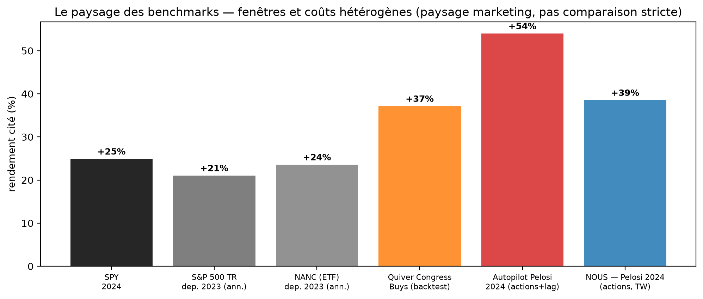

# 1 · Copier les membres *(strate 2 de [l'inventaire des pistes](../PISTES_TESTEES.md))*

La question : *copier les meilleurs élus bat-il le marché ?* Le notebook de la strate :
[`copier_les_membres.ipynb`](copier_les_membres.ipynb) — la spécification mathématique
(reconstruction des portefeuilles, IR/appraisal, top-K walk-forward, pondérations, Ledoit-Wolf)
**et son autopsie** (§13-§17). Ses 27 figures vivent dans le notebook (sorties figées).

## Les résultats

- **20 élus « significatifs » bruts → 12 par appraisal ≈ 11 attendus par hasard** : le surnombre
  disparaît dès qu'on retire le marché ;
- meilleur portefeuille de tout le notebook : K walk-forward **+4,07 %/an (t 1,58)** — max de
  **160 essais** (E[max t | hasard] = 2,69), Deflated Sharpe 0,11 ;
- l'analyse d'après-coup montre que c'était écrit : le Sharpe passé ne prédit pas (IC **0,047**)
  et le protocole n'a pas la puissance (MDE ≈ **8 %/an** — détecter +2 %/an demanderait
  ~170 ans de données) ;
- le test le plus propre du projet — le même élu dans le périmètre de ses commissions,
  intra-membre : **p 0,54**. La dernière hypothèse mécaniste s'éteint ;
- une seule dimension reste en sommeil : conjoint vs élu (p 0,063, cohérente avant comme
  après 2020).

La strate est **close**. Son rapport : `_archive/RAPPORT_PORTEFEUILLE_MEMBRE.pdf` (branche
`presentation`) ; le premier passage (trade-based) : `_archive/06_…` ; les chiffres restent
adossés à la table v1 du 04/07 (archivée).

## `etudes/` — comprendre la population (pas une strate)

- [`etude_population.ipynb`](etudes/etude_population.ipynb) — qui trade, comment, six portraits ;
  il re-prouve le moteur de `copier_les_membres` par ré-exécution indépendante ;
- [`etude_portraits.ipynb`](etudes/etude_portraits.ipynb) — l'usine à images de la partie II du
  deck ; ses figures vivent dans `00_recuperation_donnees/png/figs_pop/`.

*Le détail piste par piste : [PISTES_TESTEES.md](../PISTES_TESTEES.md), strates 1-2.*
