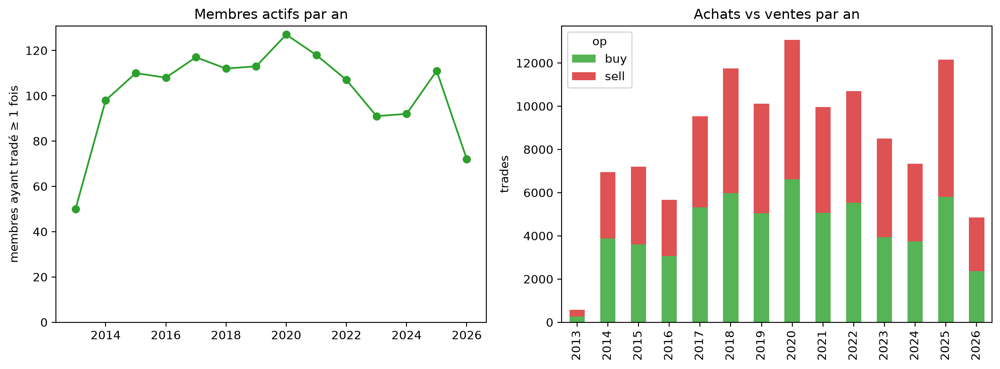
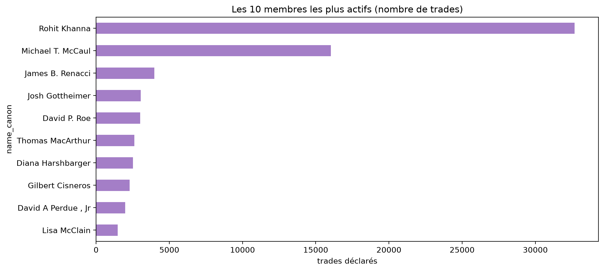
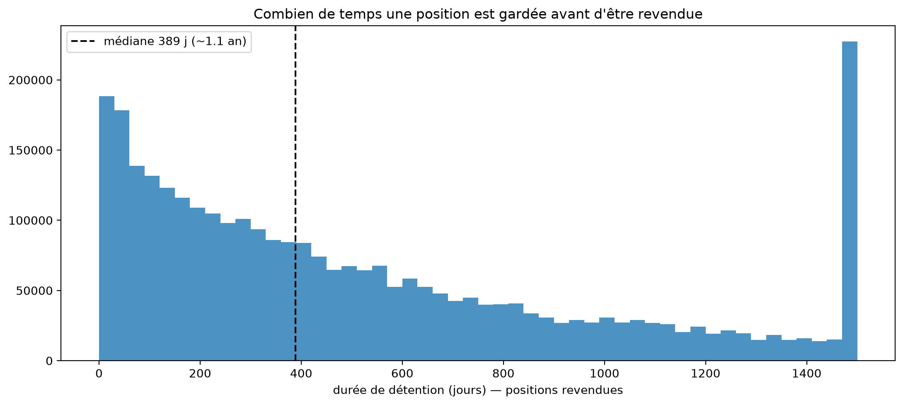
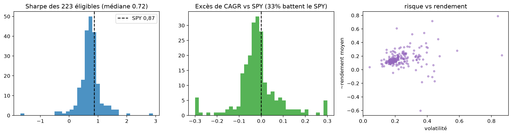
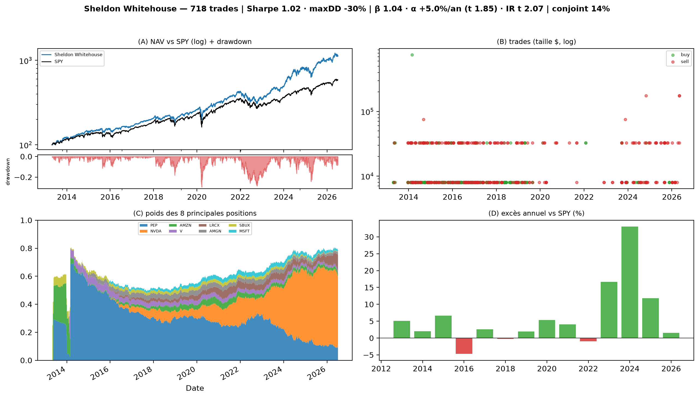
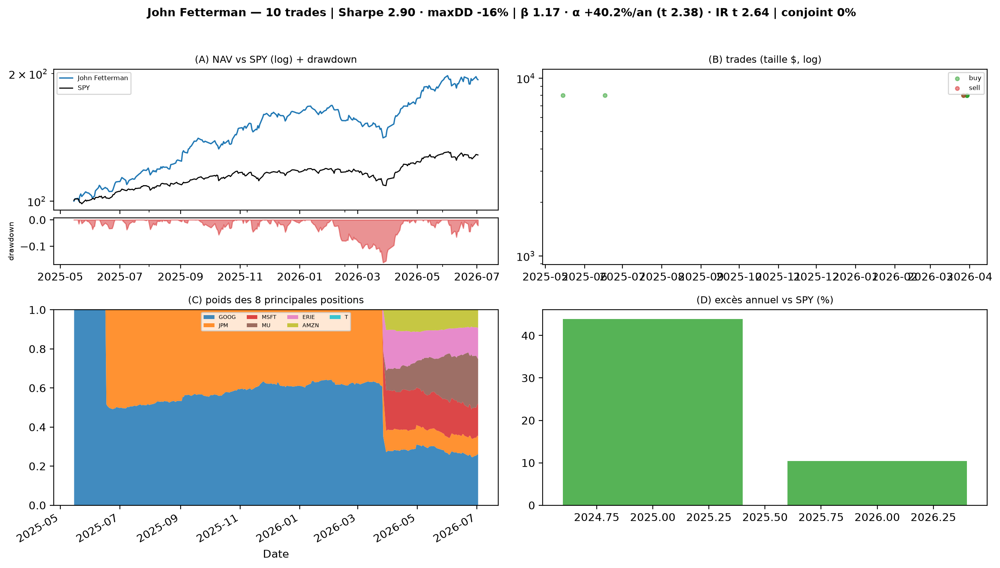

# 1 · Copier les membres *(strate 2 de [l'inventaire des pistes](../PISTES_TESTEES.md))*

La question : *copier les meilleurs élus bat-il le marché ?* **Réponse : non — et la partie II
du deck [`SLIDES_DONNEES`](../../00_recuperation_donnees/SLIDES_DONNEES.pdf) raconte pourquoi en
quatre étapes.** Ce README suit son déroulé, avec les chiffres re-certifiés sur la table propre
du pipeline. La preuve complète : [`copier_les_membres.ipynb`](copier_les_membres.ipynb)
(génération 2 — socle [`tools/membre`](../tools/membre/__init__.py), ré-exécuté en entier).

## Étape A — à quoi ressemble la population

**Une centaine de membres actifs par an, et deux personnes font 41 % des trades** (Khanna,
McCaul — qui ne passent pas leurs ordres eux-mêmes : 2,3 % et 0,0 % par l'élu). Le conjoint
passe 38 % des ordres ; 75 % des montants sont dans la première fourchette (milieu 8 000 $) ;
la déclaration arrive 27 jours après le trade en médiane ; 19 % des achats tombent dans un
secteur régulé par les comités du membre — avec des exceptions (Hickenlooper ~90 %).

## Étape B — à quoi ressemble un portefeuille

On ne déclare que des transactions : les portefeuilles se **reconstruisent** (parts FIFO, prix
ajustés, rendement en parts — un apport n'est jamais une performance). Sur les 266 portefeuilles
reconstruits : Sharpe médian 0,71, et des positions **lentes** — tenue médiane ~1 an,
**44 % des positions jamais revendues** : peu d'occasions de copier.

## Étape C — l'échelle des cinq tests

**La question naïve donne un « oui » trompeur** (33 % des éligibles battent le SPY sur leur
fenêtre — mais Sharpe médian 0,72 contre 0,83 pour le SPY). Mesurée proprement sur les
**223 membres jugeables** : **20** « gagnants » à l'écart brut, **12** une fois le marché
retiré, **≈ 11 attendus par pur hasard**.

Puis les cinq réglages, un à la fois — aucun ne fait décrocher l'excès du hasard :

| test | réglage | résultat |
|---|---|---|
| 1 · QUI | copier le top-4, sans regarder le futur | +2,8 %/an mais **t 0,80**, β 1,21, α ≈ 0 |
| 2 · COMBIEN | K choisi en walk-forward | +4,06 %/an, **t 1,58** (seuil 1,81) |
| 3 · QUAND | cadence 6 mois | rien |
| 4 · COMMENT | inverse-vol, ERC, GMV (Ledoit-Wolf) | max t_appraisal **+0,48** ; GMV −4,5 %/an |
| 5 · LA RÈGLE | classement par le Sharpe brut | le t **plafonne à 1,21** (K=6) |

## Étape D — les portraits : pourquoi le classement ment

Fetterman est 1ᵉʳ sur **10 trades et 1 an** ; Ruiz est « significatif » avec **0 %** de trades
gagnants (β 0,09) ; McClain fait +41 %/an **par son β** (1,76) ; Khanna, 32 700 trades, un
profit factor de 0,88. Le seul candidat sérieux reste modeste : **Whitehouse, 718 trades,
+6 %/an** — significatif aux deux mètres. Les 8 portraits complets : le deck, étape D (et
`figs_pop/G_*_portrait.png`).

**La strate est close.** On mesure des personnes, pas le Congrès — pas d'alpha copiable.

## `etudes/` — le producteur des figures du deck

[`figures_du_deck.ipynb`](etudes/figures_du_deck.ipynb) produit les figures **à prix** de la
partie II (durées, distributions, les 8 portraits) sur `tools/membre` + `tables/membres.csv` ;
les 7 figures de population **sans prix** sont produites par la chaîne du rapport
(`common/quality.py`, régénérées avec lui). Le dossier `figs_pop/` = exactement ces 17 figures
(contrat asserté par le notebook). Les anciennes études exploratoires et leurs 24 figures non
présentées : `_archive/etudes_v1_20260720/` (branche `presentation`).

*Le détail piste par piste : [PISTES_TESTEES.md](../PISTES_TESTEES.md), strates 1-2. La preuve
rejouable du socle : `python -m tools.membre.test_ancres_membre`.*
