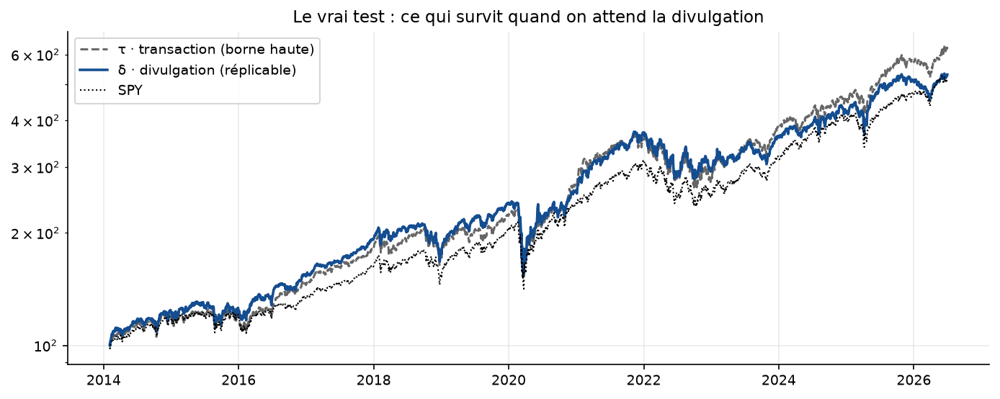
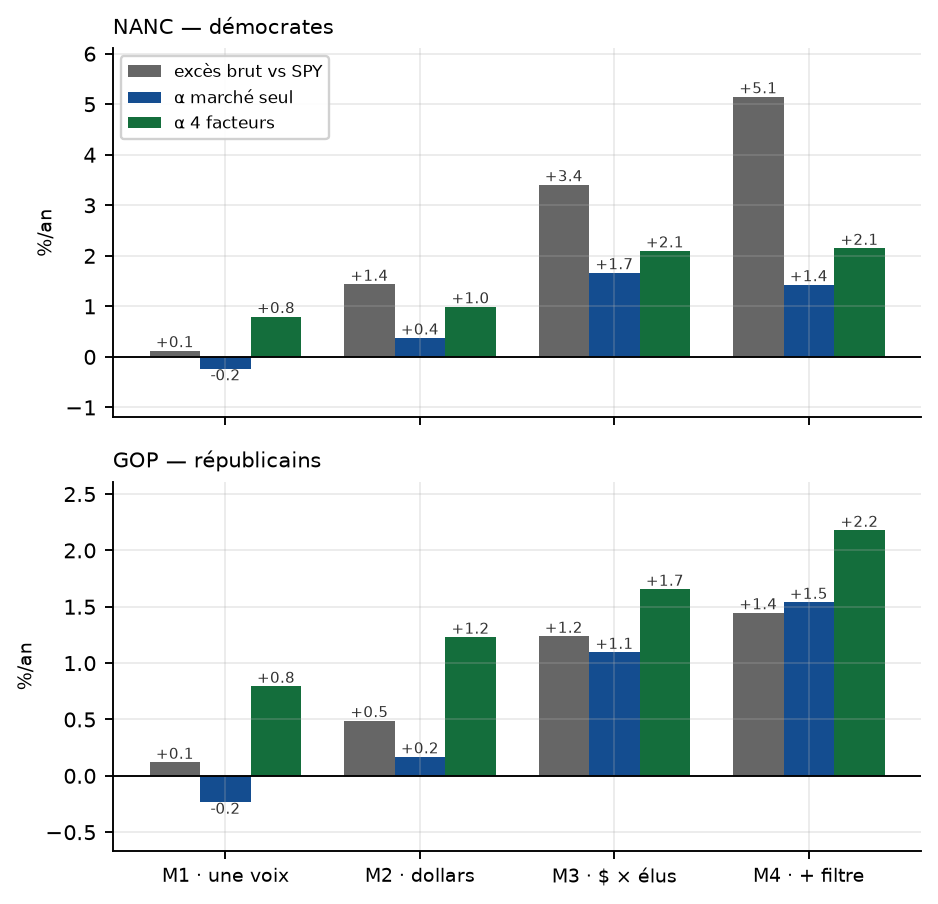
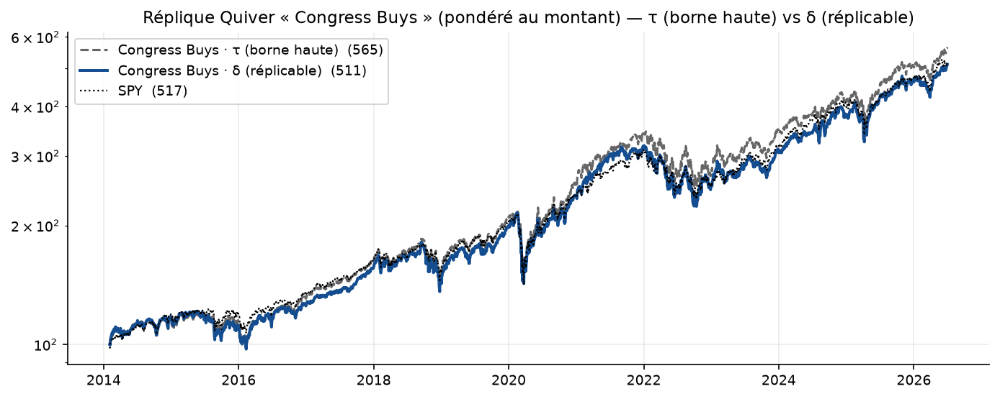

# 2 · Noter les titres *(strate 5 de [l'inventaire des pistes](../PISTES_TESTEES.md))*

Le virage du projet : on ne copie plus des élus, on **score des titres** — dollars déclarés ×
nombre d'élus, purge FIFO γ (γ = la part d'une vente qui compte encore, premier entré-premier
sorti), fenêtre choisie sur la concentration. Trois volets, découpés du même run (sorties
figées) ; les §N sont les sections du notebook d'origine :

| volet | contenu |
|---|---|
| [`noter_les_titres.ipynb`](noter_les_titres.ipynb) | le socle (§1-§7), les 6 tests (§8-§11), les autres pistes (§12), les méthodes M1→M4 (§16-§17) |
| [`replique_NANC_GOP.ipynb`](replique_NANC_GOP.ipynb) | la réplique des ETF NANC/GOP — six versions, et le diagnostic d'échelle : leurs positions valent jusqu'à 25× le flux déclaré (§13.0-§13.15) |
| [`repliques_quiver.ipynb`](repliques_quiver.ipynb) | les stratégies Quiver répliquées (§14-§14.2) |

Documents : [`PAPIER_METHODE.pdf`](PAPIER_METHODE.pdf) · [`FICHE_NOTER_LES_TITRES.pdf`](FICHE_NOTER_LES_TITRES.pdf) ·
[`AUDIT_FONDS_NANC_GOP.pdf`](AUDIT_FONDS_NANC_GOP.pdf) (+ `_COMPLET.pdf`, 798 p., pièces incluses) ·
[`ETAT_DE_L_ART_STRATEGIES.md`](ETAT_DE_L_ART_STRATEGIES.md). Les 18 pièces officielles :
`docs_nanc_gop/` (brutes) et `docs_nanc_gop_surlignes/`.

## Les résultats

**Les six tests** (2014-2026, brut ; τ = date de la transaction, δ = date de **divulgation** —
la seule où l'information est publique) : à τ +1,71 %/an (t 1,03) — mais **à δ :
+0,35 %/an (t 0,18)**, le résultat qui commande tout ; short −12,8 %/an (les titres vendus
montent) ; comités +7,67 à τ mais **−3,65 à δ** ; dépôts tardifs −8,25 %/an.

**Les quatre méthodes** (achats seuls, 3 ans à δ, top-150, plafond 10 %) :

| méthode | démocrates | républicains |
|---|---|---|
| M1 · une voix par membre | +0,12 % (t 0,06) | — |
| M2 · dollars purs | +1,43 % (t 1,04) | +0,49 % (t 0,26) |
| **M3 · dollars × élus (retenue)** | **+3,40 % (t 1,61)** | **+1,24 % (t 1,61)** |
| M4 · M3 + filtre θ=50 (écarte les dépôts groupés de ≥ 50 lignes) | +5,14 % (t 1,30, β instable) | +1,44 % (t 0,98) |

**NANC/GOP** : trois versions retenues (A score · B livre · C bascule), ρ ≈ 0,73-0,75 — et le
chiffre qui clôt le dossier : leurs positions valent jusqu'à **25× le flux déclaré**, leur
fournisseur n'est pas les fourchettes publiques.

**Quiver** : réplique fidèle ≈ **22 %/an** (2020-26) contre **36,2 % annoncés** — tous leurs
paramètres divulgués sont matchés, leur panneau de métriques est incohérent (vol 4,63 % avec
β 1,14) ; l'écart vit dans leur boîte noire.

*Le détail piste par piste : [PISTES_TESTEES.md](../PISTES_TESTEES.md), strate 5.*
