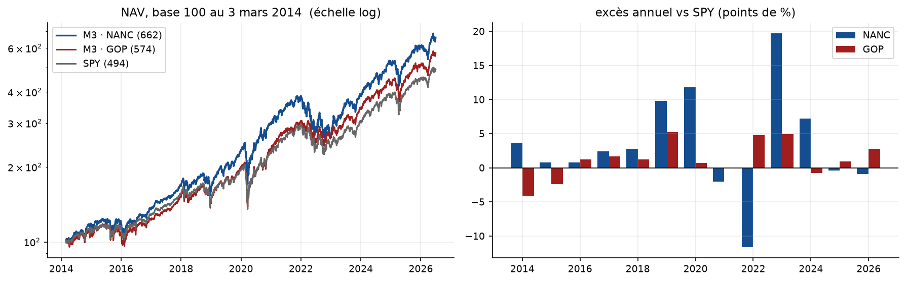
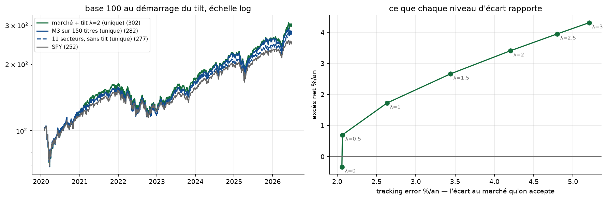
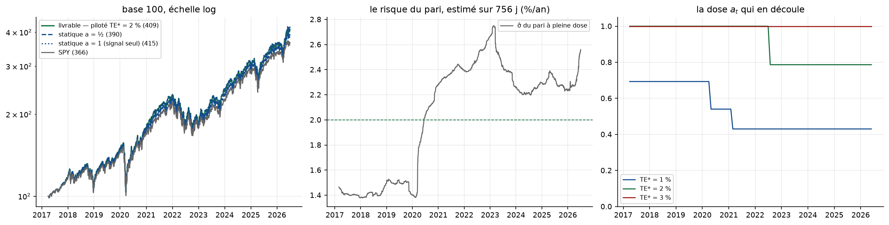

# 3 · Le livrable M3 *(strate 7 de la carte de la recherche)*

**Le couple qui fait foi** : [`M3_preuve_complete.ipynb`](M3_preuve_complete.ipynb) (tout ce que
la fiche affirme y est établi) + [`FICHE_M3.pdf`](FICHE_M3.pdf) (4 pages). Depuis le 11/08, le
notebook est en **génération 2** : son socle (chargement, moteur, mesure, carte ETF) est importé
du paquet [`tools/`](../tools/README.md) — extrait de lui, prouvé par `python -m tools.test_ancres` —
et **toutes ses cellules d'analyse et de validation re-dérivent le reste indépendamment** ;
ré-exécuté en entier, chaque assert passe, mêmes ancres.

## Les résultats

| portefeuille | excès /an | t | NAV (base 100, 2014) | années gagnantes |
|---|---|---|---|---|
| M3 · démocrates (titres) | **+3,40 %** | 1,61 | **662** | 9/13 |
| M3 · républicains (titres) | **+1,24 %** | 1,61 | **574** | 9/13 |
| M3 · unique (les deux partis) | **+2,51 %** | 1,93 | 629 | 8/13 |
| version ETF, carte datée (unique) | **+1,45 %** | 2,05 | 577 | — |
| *repère : SPY* | — | — | *494* | — |

Le produit (dollars × élus) dépasse ses deux composantes ; aucun excès sur 13 ans ne franchit le
seuil de Student (2,18) — 162 runs publiés, l'annexe D de la fiche dit ce qui n'est pas établi.

## Le portefeuille final : deux poches (§20)

Une poche SPY + une poche signal sectoriel, dose analytique a = min(1, TE\*/σ̂) sur 756 j —
IR constant 0,637 à toutes les doses (doser plus achète du rendement, jamais de la preuve),
calibration honnête (TE\* 3 % se lit ≈ 3,8 % réalisé), transfer coefficient 0,947. Le seul
paramètre libre, **TE\***, est le budget de risque du client — la question à poser à Ramify.
À la dernière coupe (29/05/2026, TE\* = 2 %) : a = 0,832 → **16,8 % SPY + 83,2 % signal, 12 lignes**.

## La table du pipeline

[`M3_table_pipeline.ipynb`](M3_table_pipeline.ipynb) — le notebook **mince** (20 cellules, 33 s,
tout sur `tools/`) qui rejoue chaque bloc de la fiche sur la **table courante** du pipeline :
**+3,42 / +1,21 / +2,51** contre +3,40 / +1,24 / +2,51 publiés, ETF +1,49, IR des deux poches
constant (0,648), calibration 1,28 — **aucune conclusion ne change**. Ses ancres :
[`ancres_table_courante.json`](ancres_table_courante.json).

*Le chemin complet des pistes testées : [la carte de la recherche](../README.md). Les ancres
de la fiche sont adossées à la table v1 du 04/07 (archivée) — reproduction : `python -m
tools.test_ancres` depuis la racine du 02 ; la table courante se lit dans `M3_table_pipeline`.*
