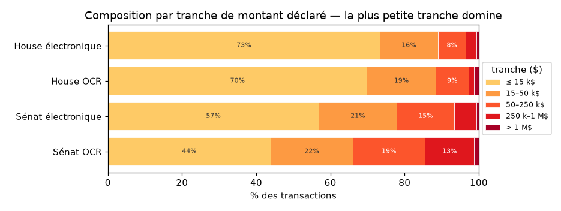

# Rapport qualité — Données de trading du Congrès américain
> Chambre des représentants + Sénat · 2020–2026 · généré par `python -m common.quality` (lecture seule des tables FINAL, aucun appel API) · Quiver Quantitative = vérité-terrain externe, **jamais réinjectée**.

## Résumé exécutif

- **Périmètre** — 89 852 transactions uniques de membres élus (House 81 607 + Sénat 8 245), 2020–2026, en **4 sous-corpus** (chambre × voie d'acquisition : électronique déterministe / scan OCR).
- **Complétude vs Quiver** *(§6)* — dans notre fenêtre, on retrouve **93.8 % (House) / 91.5 % (Sénat)** des trades Quiver au niveau (déposant, ticker, sens). Le **vrai trou coté est minuscule** (22 House / 0 Sénat) ; le reste du résidu est de l'OCR récupérable ou du hors-périmètre.
- **On est plus complet que Quiver** — **+6886 actions cotées qu'on a et que Quiver n'a pas, contre 13 trous inverses.** La base est, en pratique, un **sur-ensemble** de Quiver.
- **Les « écarts » de date ne sont pas des erreurs** — la réconciliation 1-à-1 (§6.3) montre que l'essentiel est du « nous-seul » (Quiver n'a pas le trade) ; seuls 414 candidats House (même dépôt) méritent l'œil, et le vrai contrôle des dates reste l'audit PDF (§2).
- **Données propres** — identité rattachée à 100.0 %, dates cohérentes 99.8 %, délai de divulgation médian 28 j, montants renseignés 99.0 %.

*Plan : §1 composition · §2 cohérence des dates · §3 délai légal · §4 montants · §5 couverture & structure · §6 complétude vs Quiver (vérité-terrain).*

## 1. Composition & qualité par sous-corpus

Les déclarations proviennent de **quatre sous-corpus** très différents (chambre × voie d'acquisition). Toute la suite distingue ces quatre familles, car leur qualité et leur composition diffèrent.

| sous-corpus | n | part % |
| --- | --- | --- |
| House électronique | 32667 | 36.4 |
| House OCR | 48940 | 54.5 |
| Sénat électronique | 6566 | 7.3 |
| Sénat OCR | 1679 | 1.9 |
*sous-corpus = chambre × voie (électronique déterministe / scan OCR) · n = transactions uniques · part % du total*

### Couverture des champs enrichis (taux de remplissage)

| sous-corpus | n | ticker % | secteur % | ETF % | commission % | identité % | ancienneté % |
| --- | --- | --- | --- | --- | --- | --- | --- |
| House électronique | 32667 | 88.7 | 86.6 | 86.6 | 74.7 | 100.0 | 100.0 |
| House OCR | 48940 | 83.1 | 81.0 | 81.0 | 94.5 | 100.0 | 100.0 |
| Sénat électronique | 6566 | 79.3 | 71.3 | 71.3 | 62.5 | 100.0 | 100.0 |
| Sénat OCR | 1679 | 33.2 | 19.4 | 19.4 | 96.1 | 100.0 | 100.0 |
*% de lignes où le champ est renseigné · identité = rattachée à un `bioguide_id` · ticker/secteur/ETF vides = actif non coté (normal, pas un défaut)*

### Scorecard de qualité

| sous-corpus | n | dates cohérentes % | date plausible % | année aberrante (n) | montant renseigné % |
| --- | --- | --- | --- | --- | --- |
| House électronique | 32667 | 99.9 | 86.8 | 0 | 100.0 |
| House OCR | 48940 | 99.7 | 95.4 | 0 | 98.2 |
| Sénat électronique | 6566 | 100.0 | 92.5 | 0 | 100.0 |
| Sénat OCR | 1679 | 99.8 | 98.5 | 0 | 99.6 |
*dates cohérentes = divulgation ≥ transaction · date plausible = transaction ∈ [0, 75 j] avant divulgation · année aberrante = année impossible (postérieure au dépôt, ou < 2012) · montant renseigné = `amount_midpoint` non vide*

### Mix par sous-corpus

**Sens des opérations :**

| sous-corpus | n | achat % | vente % | échange % | autre % |
| --- | --- | --- | --- | --- | --- |
| House électronique | 32667 | 49.7 | 49.7 | 0.6 | 0.0 |
| House OCR | 48940 | 52.7 | 46.6 | 0.7 | 0.0 |
| Sénat électronique | 6566 | 48.6 | 50.5 | 0.9 | 0.0 |
| Sénat OCR | 1679 | 54.0 | 45.8 | 0.2 | 0.0 |
*achat = `operation_type` contient « Purchase » · vente = contient « Sale » (**inclut Sale (Partial) et (Full)**) · échange = « Exchange » · autre = reste*


**Détenteur déclaré :**

| sous-corpus | n | perso % | conjoint % | joint % | enfant % | autre % |
| --- | --- | --- | --- | --- | --- | --- |
| House électronique | 32667 | 51.9 | 19.7 | 26.2 | 2.2 | 0.0 |
| House OCR | 48940 | 6.7 | 51.1 | 7.0 | 35.2 | 0.0 |
| Sénat électronique | 6566 | 15.7 | 41.4 | 40.1 | 2.9 | 0.0 |
| Sénat OCR | 1679 | 26.9 | 73.0 | 0.1 | 0.1 | 0.0 |
*titulaire du compte : perso = Self · conjoint = Spouse/SP · joint = Joint/JT · enfant = Dependent/Child/DC · autre = reste ou non déclaré*

**Familles d'actifs** (le non-coté — oblig. d'État, munis, obligations — domine l'OCR du Sénat) :

| sous-corpus | n | action % | option % | oblig. État % | muni % | oblig. corp. % | fonds % | autre % | manquant % |
| --- | --- | --- | --- | --- | --- | --- | --- | --- | --- |
| House électronique | 32667 | 84.6 | 1.8 | 5.9 | 0.0 | 0.0 | 0.0 | 6.1 | 1.6 |
| House OCR | 48940 | 81.7 | 0.0 | 0.8 | 0.0 | 0.1 | 3.1 | 0.6 | 13.8 |
| Sénat électronique | 6566 | 67.2 | 9.1 | 0.0 | 10.8 | 3.0 | 0.0 | 10.0 | 0.0 |
| Sénat OCR | 1679 | 12.9 | 0.0 | 0.0 | 0.8 | 2.6 | 0.0 | 69.6 | 14.2 |
*familles d'`asset_type` : action = Stock · option · oblig. État = Gov/Treasury · muni = Municipal · oblig. corp. = Bond · fonds = Fund/ETF · manquant = vide*


### Secteurs & sources de résolution

| sous-corpus | n | secteur renseigné % | ETF % | top 3 secteurs |
| --- | --- | --- | --- | --- |
| House électronique | 32667 | 86.6 | 86.6 | Information Technology 20%, Financials 14%, Health Care 13% |
| House OCR | 48940 | 81.0 | 81.0 | Information Technology 20%, Financials 16%, Health Care 14% |
| Sénat électronique | 6566 | 71.3 | 71.3 | Information Technology 22%, Financials 16%, Consumer Discretionary 10% |
| Sénat OCR | 1679 | 19.4 | 19.4 | Financials 21%, Communication Services 18%, Information Technology 12% |
*secteur renseigné % / ETF % = taux de remplissage (vide = non coté) · top 3 = secteurs GICS dominants*

**Origine du ticker** (`ticker_source` — comment le ticker a été obtenu) :

| sous-corpus | n | dico élec % | LLM % | explicite % | aucune % |
| --- | --- | --- | --- | --- | --- |
| House électronique | 32667 | 0.0 | 0.0 | 88.7 | 11.3 |
| House OCR | 48940 | 45.6 | 36.2 | 1.3 | 16.9 |
| Sénat électronique | 6566 | 0.5 | 0.7 | 77.1 | 20.7 |
| Sénat OCR | 1679 | 9.5 | 8.3 | 15.4 | 66.8 |
*comment le ticker est obtenu : dico élec = repris de l'électronique · LLM = résolu par LLM · explicite = déjà présent dans la source · aucune = non résolu*

**Origine du secteur** (`sector_source`) :

| sous-corpus | n | yfinance % | LLM % | manuel % | aucune % |
| --- | --- | --- | --- | --- | --- |
| House électronique | 32667 | 78.7 | 7.8 | 0.2 | 13.3 |
| House OCR | 48940 | 75.4 | 5.6 | 0.1 | 18.9 |
| Sénat électronique | 6566 | 62.1 | 9.0 | 0.9 | 28.0 |
| Sénat OCR | 1679 | 12.0 | 7.4 | 1.1 | 79.5 |
*comment le secteur GICS est obtenu : yfinance = base factuelle · LLM · manuel = correction d'audit · aucune*


### Montants par sous-corpus

| sous-corpus | n | médiane $ | moyenne $ | P25_$ | P75_$ | P95_$ | volume total M$ |
| --- | --- | --- | --- | --- | --- | --- | --- |
| House électronique | 32667 | 8000 | 53307 | 8000 | 15001 | 100001 | 1741.4 |
| House OCR | 48940 | 8000 | 49627 | 8000 | 32500 | 175000 | 2386.0 |
| Sénat électronique | 6566 | 8000 | 100115 | 8000 | 32500 | 375000 | 657.4 |
| Sénat OCR | 1679 | 32500 | 171021 | 8000 | 75000 | 750000 | 285.9 |
*$ = midpoint des fourchettes déclarées · P25/P75/P95 = percentiles · volume total = Σ midpoint*




*la plus petite tranche (≤ 15 k$, midpoint 8 000 $) domine → dès qu'elle dépasse 50 %, le P25 ET la médiane y tombent ensemble (cas House/Sénat élec). Sénat OCR < 50 % → médiane 32 500 ≠ P25 8 000.*

### Concentration de l'activité

| sous-corpus | n déposants | HHI | Gini | top10 volume % |
| --- | --- | --- | --- | --- |
| House électronique | 234 | 662.7 | 0.877 | 68.8 |
| House OCR | 40 | 2888.3 | 0.913 | 98.7 |
| Sénat électronique | 61 | 1269.1 | 0.835 | 84.6 |
| Sénat OCR | 5 | 6388.7 | 0.695 | 100.0 |

`HHI` ∈ [0, 10000] et `Gini` ∈ [0, 1] mesurent la concentration du volume par déposant (plus c'est haut, plus quelques déposants dominent).


**Top tickers par volume estimé :**

| ticker | n trades | volume M$ |
| --- | --- | --- |
| MSFT | 1011 | 261.3 |
| ICE | 110 | 93.4 |
| BRP | 7 | 81.8 |
| AAPL | 739 | 80.4 |
| MET | 114 | 76.2 |
| T | 338 | 63.1 |
| NVDA | 594 | 46.1 |
| DFS | 66 | 42.9 |
| AMZN | 684 | 42.3 |
| HBI | 65 | 38.3 |
| GOOGL | 599 | 29.8 |
| ADBE | 381 | 23.2 |
| AVGO | 269 | 18.1 |
| PYPL | 355 | 17.0 |
| AESI | 5 | 15.9 |
*volume M$ = Σ midpoint des trades du ticker · n trades = nombre de transactions*

**Volume par secteur GICS :**

| secteur | n trades | volume M$ |
| --- | --- | --- |
| Information Technology | 14315 | 725.9 |
| Financials | 10981 | 520.7 |
| Communication Services | 5593 | 263.1 |
| Consumer Discretionary | 8309 | 259.7 |
| Health Care | 9495 | 229.7 |
| Industrials | 8476 | 196.8 |
| Energy | 3077 | 141.5 |
| Consumer Staples | 5137 | 138.5 |
| Materials | 2898 | 61.8 |
| Real Estate | 2729 | 53.6 |
| Utilities | 1274 | 30.5 |

## 2. Cohérence des dates (`disclosure_date ≥ transaction_date`)
| chambre | n | dates exploitables % | cohérentes % | incohérentes | année aberrante | date manquante |
| --- | --- | --- | --- | --- | --- | --- |
| house | 81607 | 99.8 | 99.8 | 154 | 0 | 177 |
| senate | 8245 | 99.9 | 100.0 | 3 | 0 | 7 |

**Par sous-corpus :**

| sous-corpus | n | dates exploitables % | cohérentes % | incohérentes | année aberrante | date manquante |
| --- | --- | --- | --- | --- | --- | --- |
| House électronique | 32667 | 100.0 | 99.9 | 18 | 0 | 0 |
| House OCR | 48940 | 99.6 | 99.7 | 136 | 0 | 177 |
| Sénat électronique | 6566 | 100.0 | 100.0 | 0 | 0 | 0 |
| Sénat OCR | 1679 | 99.6 | 99.8 | 3 | 0 | 7 |
*dates exploitables = dates parseables (le reste = OCR illisible) · cohérentes = divulgation ≥ transaction · incohérentes = divulgation AVANT transaction (amendement/antidaté) · année aberrante = année impossible (postérieure au dépôt, ou < 2012) · date manquante = illisible. Des transactions 2013–2019 sont légitimes (divulgations tardives).*

**Audit des anomalies (échantillon de 12 PDF re-lus à la source).** ~½ sont FIDÈLES : coquilles du **déposant lui-même** (un PTR imprime littéralement `01/35/22`), cellules vides ou parts de société sans date de transaction — on les transcrit sans les inventer. ~⅓ = **notre OCR** (mois/jour mal lu), corrigé à la lecture **quand le formulaire est lisible** (4 dates vérifiées, clé doc+date, figé inchangé). ~⅙ = **provenance** (hallucination OCR ou pièce jointe absente du PDF). **On ne fabrique aucune date** : les illisibles restent flaggées.

## 3. Délai légal de divulgation (STOCK Act ~45 j)
| chambre | n dates valides | ≤45j légal % | 45–75j % | >75j % | négatif % | délai médian (j) |
| --- | --- | --- | --- | --- | --- | --- |
| house | 81430 | 87.0 | 5.2 | 7.7 | 0.2 | 28 |
| senate | 8238 | 91.0 | 2.8 | 6.2 | 0.0 | 27 |

**Par sous-corpus :**

| sous-corpus | n dates valides | ≤45j légal % | 45–75j % | >75j % | négatif % | délai médian (j) |
| --- | --- | --- | --- | --- | --- | --- |
| House électronique | 32667 | 81.9 | 4.9 | 13.2 | 0.1 | 28 |
| House OCR | 48763 | 90.3 | 5.4 | 4.0 | 0.3 | 28 |
| Sénat électronique | 6566 | 90.6 | 1.9 | 7.5 | 0.0 | 26 |
| Sénat OCR | 1672 | 92.4 | 6.5 | 0.9 | 0.2 | 29 |
*n dates valides = transactions dont le délai est CALCULABLE (les deux dates, transaction ET divulgation, présentes et lisibles ; « valide » = mesurable, pas « juste ») · délai = divulgation − transaction (jours) · ≤45 j = délai légal STOCK Act · 45–75 j = marge tolérée · >75 j = retard · négatif = anomalie (divulgation avant transaction), comptée quand même dans n dates valides · délai médian en jours*


**Divulgations les plus tardives (> 365 j, suspects) :**

| déposant | chambre | date txn | date divulg. | délai (j) | ticker | opération |
| --- | --- | --- | --- | --- | --- | --- |
| Jefferson Shreve | house | 2015-05-08 | 2025-06-22 | 3698.0 | DHR | Purchase |
| Jefferson Shreve | house | 2015-05-08 | 2025-06-22 | 3698.0 | DAL | Purchase |
| Richard W. Allen | house | 2017-02-03 | 2023-08-10 | 2379.0 |  | Purchase |
| Richard W. Allen | house | 2017-02-13 | 2023-08-10 | 2369.0 | O | Sale |
| Richard W. Allen | house | 2017-03-23 | 2023-08-10 | 2331.0 | BBT | Sale |
| Richard W. Allen | house | 2017-03-23 | 2023-08-10 | 2331.0 | BBT | Sale (Partial) |
| Richard W. Allen | house | 2017-04-27 | 2023-08-10 | 2296.0 | XOM | Sale |
| Richard W. Allen | house | 2017-04-27 | 2023-08-10 | 2296.0 | COST | Purchase |
| Richard W. Allen | house | 2017-05-16 | 2023-08-10 | 2277.0 | GE | Sale |
| Richard W. Allen | house | 2017-05-16 | 2023-08-10 | 2277.0 | FDX | Purchase |
| Thomas Suozzi | house | 2017-01-05 | 2022-12-19 | 2174.0 | PCLN | Sale |
| Thomas Suozzi | house | 2017-01-05 | 2022-12-19 | 2174.0 | DFS | Sale |
| Thomas Suozzi | house | 2017-01-05 | 2022-12-19 | 2174.0 | CME | Sale |
| Thomas Suozzi | house | 2017-01-05 | 2022-12-19 | 2174.0 | FB | Sale |
| Thomas Suozzi | house | 2017-01-05 | 2022-12-19 | 2174.0 | KMX | Sale |
*délai (j) = divulgation − transaction · divulgations > 1 an après la transaction (souvent des amendements ou de vieux comptes régularisés)*

## 4. Distribution des montants (`amount_midpoint`)

Stats globales (USD, midpoint des fourchettes déclarées) :

```
count       88982.0
mean        56985.0
std        595298.0
min             1.0
25%          8000.0
50%          8000.0
75%         32500.0
90%         75000.0
max      75000000.0
```

Par chambre :

```
           count      mean       std     min     25%     50%      75%         max
chamber                                                                          
house    80744.0   51116.0  569184.0     1.0  8000.0  8000.0  32500.0  75000000.0
senate    8238.0  114506.0  805522.0  8000.0  8000.0  8000.0  32500.0  50000000.0
```

Par sous-corpus :

```
                      count      mean        std     min     25%      50%      75%         max
corpus                                                                                        
House électronique  32667.0   53307.0   522013.0     1.0  8000.0   8000.0  15001.0  37500000.0
House OCR           48077.0   49628.0   599121.0  8000.0  8000.0   8000.0  32500.0  75000000.0
Sénat électronique   6566.0  100115.0   632303.0  8000.0  8000.0   8000.0  32500.0  15000000.0
Sénat OCR            1672.0  171021.0  1274262.0  8000.0  8000.0  32500.0  75000.0  50000000.0
```

*count = nb · mean = moyenne · std = écart-type · 25/50/75 % = quartiles · USD (midpoint des fourchettes déclarées)*


**Top 15 déposants par volume estimé (Σ midpoint) :**

| déposant | chambre | n trades | volume estimé M$ |
| --- | --- | --- | --- |
| Michael T. McCaul | house | 10738 | 974.5 |
| Rohit Khanna | house | 30516 | 667.8 |
| Diana Harshbarger | house | 3124 | 464.5 |
| Darrell E. Issa | house | 20 | 250.5 |
| RICHARD BLUMENTHAL | senate | 1226 | 221.3 |
| Josh Gottheimer | house | 2942 | 209.4 |
| Jefferson Shreve | house | 631 | 191.7 |
| Scott Franklin | house | 68 | 182.1 |
| Rick Scott | senate | 266 | 167.2 |
| Nancy Pelosi | house | 147 | 139.6 |
| Suzan K. DelBene | house | 406 | 125.9 |
| Kelly Loeffler | senate | 329 | 120.9 |
| David H McCormick | senate | 293 | 69.0 |
| Scott H. Peters | house | 334 | 64.6 |
| Kevin Hern | house | 760 | 60.1 |
*volume estimé M$ = Σ midpoint des transactions du déposant · n trades = nombre de transactions*

## 5. Couverture par déposant & structure de l'activité

320 déposants distincts. **206** ont ≥ 10 transactions (éligibles au backtest), dont **150** actifs sur ≥ 3 années.


**Top 20 déposants (transactions, OCR%, années actives) :**

| nom | total | dont OCR | OCR % | n années | 1re année | dern. année |
| --- | --- | --- | --- | --- | --- | --- |
| Rohit Khanna | 30862 | 30862 | 100 | 8 | 2019 | 2026 |
| Michael T. McCaul | 10850 | 10850 | 100 | 7 | 2020 | 2026 |
| Diana Harshbarger | 3515 | 3514 | 100 | 4 | 2021 | 2026 |
| Josh Gottheimer | 2942 | 0 | 0 | 8 | 2019 | 2026 |
| Gilbert Cisneros | 2153 | 0 | 0 | 4 | 2019 | 2026 |
| David P. Roe | 1686 | 1686 | 100 | 1 | 2020 | 2020 |
| Lisa McClain | 1532 | 109 | 7 | 3 | 2024 | 2026 |
| Thomas H Tuberville | 1369 | 0 | 0 | 5 | 2021 | 2025 |
| Daniel Goldman | 1291 | 0 | 0 | 2 | 2023 | 2025 |
| RICHARD BLUMENTHAL | 1232 | 1232 | 100 | 8 | 2019 | 2026 |
| Thomas R Carper | 923 | 0 | 0 | 6 | 2019 | 2024 |
| Susie Lee | 857 | 0 | 0 | 8 | 2019 | 2026 |
| Donald Sternoff Beyer | 822 | 0 | 0 | 8 | 2019 | 2026 |
| Kathy Manning | 803 | 0 | 0 | 5 | 2021 | 2025 |
| JOHN BOOZMAN | 768 | 379 | 49 | 8 | 2019 | 2026 |
| Thomas Suozzi | 765 | 20 | 3 | 9 | 2017 | 2026 |
| Kevin Hern | 760 | 0 | 0 | 8 | 2019 | 2026 |
| Alan S. Lowenthal | 676 | 0 | 0 | 4 | 2019 | 2022 |
| Lois Frankel | 656 | 0 | 0 | 5 | 2019 | 2023 |
| Mark Green | 653 | 0 | 0 | 6 | 2020 | 2025 |
*total = nb transactions · dont OCR / OCR % = part scannée · n années = années actives · 1re/dern. année = première/dernière année de transaction*

### Devenir des achats à +12 mois (revente vs fermeture forcée, pour la stratégie)

Pour chaque achat (avec ticker), on suit la position : est-elle **revendue par le même membre sur le même ticker dans les 12 mois** (l'horizon de fermeture forcée de la stratégie) ? L'appariement se fait sur la **date de divulgation** — ce que la stratégie peut observer. Les achats divulgués il y a **moins de 12 mois** (après 2025-06-25) n'ont pas assez de recul pour juger : marqués *trop récents* et exclus des taux.

| chambre | achats (avec ticker) | trop récents | observables | revendu ≤12m | revendu ≤12m % | fermé de force | fermé de force +12m % |
| --- | --- | --- | --- | --- | --- | --- | --- |
| house | 34562 | 2508 | 32054 | 23151 | 72.2 | 8903 | 27.8 |
| senate | 2468 | 236 | 2232 | 1078 | 48.3 | 1154 | 51.7 |

**Par sous-corpus :**

| sous-corpus | achats (avec ticker) | trop récents | observables | revendu ≤12m | revendu ≤12m % | fermé de force | fermé de force +12m % |
| --- | --- | --- | --- | --- | --- | --- | --- |
| House électronique | 14010 | 1764 | 12246 | 6340 | 51.8 | 5906 | 48.2 |
| House OCR | 20552 | 744 | 19808 | 16811 | 84.9 | 2997 | 15.1 |
| Sénat électronique | 2301 | 231 | 2070 | 988 | 47.7 | 1082 | 52.3 |
| Sénat OCR | 167 | 5 | 162 | 90 | 55.6 | 72 | 44.4 |
*achats (avec ticker) · trop récents = <12 mois de recul depuis la divulgation (indéterminé, hors dénominateur) · observables = achats − trop récents · revendu ≤12m = une vente du même ticker divulguée dans les 12 mois · fermé de force +12m = aucune vente sous 12 mois → la stratégie clôt la position · les deux % portent sur les observables*

## 6. Complétude vs Quiver (vérité-terrain externe)

> **Section clé.** Quiver est un fournisseur commercial des mêmes données = notre **juge externe**. But : montrer qu'on a **au moins tout ce que Quiver a** (Quiver ⊆ nous), qu'on est même **plus complet**, et que nos différences ne sont **pas des erreurs**. On procède comme un **entonnoir, de strictesse croissante** : Niveau 1 → 2 → 3. Chiffres recalculés par `common/quiver_diagnosis.py`, **jamais réinjectés**.

### 6.1 Méthode

Chaque transaction est confrontée à Quiver par une clé normalisée, en **trois niveaux de plus en plus stricts** : **N1** a-t-on le trade ? *(sans la date, §6.2)* → **N2** le même trade à la même date ? *(§6.3)* → **N3** qui corrige quoi ? *(§6.5)*.

| élément | définition |
| --- | --- |
| univers comparé | tous les trades Quiver `Filed` ∈ 2020–2026 (notre fenêtre de scrape) |
| clé d'appariement | (`bioguide`, ticker normalisé, sens) — **+ date** au Niveau 2, **sans date** au Niveau 1 |
| normalisation ticker | MAJ + trim ; rejette {vide, NAN, NONE, --} ; retire ` PUT`/` CALL` ; `.`/`-` → `_` |
| normalisation sens | 1re lettre p/s/e → Purchase / Sale / Exchange |
**Périmètre** — le FINAL est dédupliqué cross-année avant comparaison (une re-divulgation tardive ne compte qu'une fois) :

| chambre | lignes brutes | re-divulgations (dédup) | transactions uniques |
| --- | --- | --- | --- |
| house | 81642 | 35 | 81607 |
| senate | 8841 | 596 | 8245 |
| TOTAL | 90483 | 631 | 89852 |

*Réf. : `house/quiver.py` (`norm_ticker`, `norm_sense`), `common/quiver_diagnosis.py`.*

### 6.2 Niveau 1 — A-t-on le trade ? (sans la date)

On compare des **combinaisons** `(membre, action, sens)`, en **ignorant volontairement la date ET le nombre** : `(Khanna, AAPL, Achat)` compte pour **un**, qu'il l'ait acheté 1 fois ou 50. La question est donc grossière **exprès** : *« a-t-on raté une combinaison ENTIÈRE que Quiver connaît ? »* — le comptage trade par trade, c'est le Niveau 2 (§6.3).

On retrouve **93.8 % (House)** et **91.5 % (Sénat)** des combinaisons Quiver. Le **vrai trou** est minuscule (22 House / 0 Sénat) ; le reste est récupérable ou hors périmètre :

| chambre | trades Quiver (fenêtre) | qu'on a | inclusion % | résidu | dont OCR récup. | dont non-coté | dont 2-jambes | dont autre chambre | vrai trou coté |
| --- | --- | --- | --- | --- | --- | --- | --- | --- | --- |
| house | 17481 | 16397 | 93.8 | 1084 | 974 | 88 | 0 | 0 | 22 |
| senate | 2587 | 2366 | 91.5 | 221 | 0 | 0 | 21 | 200 | 0 |

*Résidu :* **OCR récup.** = lignes papier ratées · **non-coté** = « ticker » Quiver non appariable (CUSIP, préférentielle, fragment) · **2-jambes** = trade sous un ticker d'échange (« PFE  VTRS » couvre « PFE ») · **autre chambre** = déposant Rep→Sén polluant le cache Sénat · **vrai trou coté** = le seul manque réel.

**Bilan net** — combinaisons cotées qu'on a et que Quiver n'a PAS vs trous inverses → on est un **sur-ensemble** de Quiver :

| chambre | actions qu'on a en + | vrais trous | solde net |
| --- | --- | --- | --- |
| house | 6206 | 10 | 6196 |
| senate | 680 | 3 | 677 |
### 6.3 Niveau 2 — Le même trade, à la même date ?

On descend au trade près. Comme un membre peut trader le même titre **plusieurs fois**, on ne demande PAS « ma date est-elle dans l'ensemble Quiver ? » : on **apparie 1-à-1** nos trades à ceux de Quiver, à l'intérieur de chaque `(membre, ticker, sens)`. Exemple :

```
Khanna, AAPL, Achat — dates :
  NOUS   : 08-jan-2020 · 13-fév-2020 · 01-juin-2020 · 10-mars-2023
  QUIVER : 08-jan-2020 · 12-fév-2020 ·                10-mars-2023

Étape 1 — on retire les dates IDENTIQUES (une par une) :
  08-jan ↔ 08-jan   et   10-mars-2023 ↔ 10-mars-2023   → 2 « apparié exact »
  (le trade 2023 s'apparie à SON 2023, jamais à un 2020)

Étape 2 — on apparie les RESTES au plus proche (plafond 90 j) :
  13-fév (nous) ↔ 12-fév (Quiver) = 1 j   → « apparié proche » (≤ 7 j, bruit de date)
  01-juin (nous) : aucun reste Quiver à < 90 j   → « NOUS-SEUL » (trade en plus)
```

Deux garde-fous répondent à « comment gérer qu'un membre ait plusieurs trades » : l'appariement **1-à-1 respecte les quantités** (si on a 50 trades et Quiver 40, **≥ 10 restent forcément en « nous-seul »**) ; le **plafond de 90 j** + l'**ancrage au dépôt** empêchent mécaniquement de confondre un trade 2020 et un trade 2023. Chaque trade tombe alors dans **une** catégorie :

| chambre | apparié exact | apparié proche (≤7j) | candidat écart | dont même dépôt | nous-seul | quiver-seul | candidat % |
| --- | --- | --- | --- | --- | --- | --- | --- |
| house | 43250 | 467 | 1764 | 414 | 21699 | 4708 | 2.6 |
| senate | 4361 | 0 | 0 | 0 | 1202 | 385 | 0.0 |
*apparié exact = même date · apparié proche = même trade à ≤ 7 j (bruit/convention de date) · candidat écart = paire à 7–90 j à inspecter (§6.4) · dont même dépôt = dans le MÊME PTR (seul signal fort) · nous-seul = Quiver n'a PAS le trade (on est plus complet) · quiver-seul = on a raté.*

**Pourquoi les chiffres semblent contredire le §6.2 : c'est le niveau de strictesse.** Au Niveau 1 (sans date), le vrai trou est 22/0 ; au Niveau 2 (trade + date), on compte 21699 trades « nous-seul » — normal, on trade plus souvent que Quiver ne capte au trade près. **Les deux disent la même chose : on est plus complet.**

### 6.4 Les candidats d'écart de date (même dépôt)

Les **seuls** candidats honnêtes d'erreur de date = les paires **dans un même dépôt** (414 House / 0 Sénat). Prudence : un petit delta peut être une **convention de date Quiver**, pas notre erreur. **Le vrai contrôle des dates reste l'audit PDF (§2)**, pas Quiver. `doc_id` = pièce consultable :

| chambre | déposant | ticker | sens | notre date | date Quiver | delta (j) | doc_id |
| --- | --- | --- | --- | --- | --- | --- | --- |
| house | Rohit Khanna | LIN | Purchase | 2022-04-21 | 2022-04-13 | 8 | 8218730 |
| house | Rohit Khanna | WES | Sale | 2020-02-13 | 2020-02-21 | 8 | 8217060 |
| house | Rohit Khanna | SBUX | Sale | 2023-10-10 | 2023-10-02 | 8 | 8220039 |
| house | Rohit Khanna | SYK | Purchase | 2020-07-29 | 2020-07-21 | 8 | 8217557 |
| house | Rohit Khanna | MRK | Purchase | 2020-07-28 | 2020-07-20 | 8 | 8217557 |
| house | Rohit Khanna | VST | Sale | 2020-05-28 | 2020-05-20 | 8 | 8217329 |
| house | Rohit Khanna | SEE | Sale | 2020-05-28 | 2020-05-20 | 8 | 8217329 |
| house | Rohit Khanna | DG | Sale | 2020-02-03 | 2020-02-11 | 8 | 8217060 |
| house | Rohit Khanna | VMC | Sale | 2022-04-11 | 2022-04-03 | 8 | 8218730 |
| house | Rohit Khanna | TRGP | Sale | 2020-02-19 | 2020-02-11 | 8 | 8217060 |
| house | Rohit Khanna | KEYS | Sale | 2020-05-28 | 2020-05-20 | 8 | 8217329 |
| house | Rohit Khanna | HLT | Sale | 2020-07-31 | 2020-07-23 | 8 | 8217557 |

*(Top 12 par delta croissant ; les 414 candidats sont dans `quiver_validation/candidats_ecart_date_meme_depot.csv`.)*

### 6.5 Niveau 3 — Que reste-t-il à corriger ?

On a vérifié l'**existence** (§6.2) et la **date** (§6.3). Restent deux choses : les **autres champs** des trades qu'on partage avec Quiver (sens, montant), et la **liste de ce qui est vraiment à corriger**.

**Autres champs — sens & montant.** Pour les trades qu'on a **tous les deux** (mêmes membre + ticker + date), est-on d'accord sur le sens (achat/vente) et le montant ?

| chambre | n paires | accord sens % | accord montant % |
| --- | --- | --- | --- |
| house | 52259 | 95.8 | 93.1 |
| senate | 4932 | 99.8 | 99.7 |
*on apparie les cellules (membre, ticker, date) présentes des DEUX côtés ; un désaccord = vraie erreur d'extraction, listée dans `desaccord_champ_*.csv`.*

**La to-do (à corriger).** Un seul chiffre est **dur** — les vrais trous `NOTRE_MANQUE` (le résidu après tous les filtres) ; les deux autres sont des **bornes hautes** ensemblistes = des listes à revoir cas par cas dans `docs/quiver_validation/`, pas des taux d'erreur :

| à corriger | House | Sénat | nature | annexe |
| --- | --- | --- | --- | --- |
| vrais trous cotés (`NOTRE_MANQUE`) | 10 | 3 | **DUR** — trade coté absent de chez nous (le résidu final filtré) | `notre_manque_*` |
| lignes OCR papier (`MANQUANT_PAPIER`) | 1066 | 0 | borne haute — trades Quiver de déposants qu'on OCR, absents de nos clés exactes | `manquant_papier_*` |
| tickers à revoir (`ECART_TICKER`) | 5539 | 71 | borne haute — autre ticker ce jour-là (gonflée par la multiplicité, PAS un taux d'erreur) | `ecart_ticker_*` |
**Qui ?** — les déposants derrière les vrais trous (`NOTRE_MANQUE`), à investiguer :

| chambre | bioguide | nom | n trous |
| --- | --- | --- | --- |
| house | B001327 | Rob Bresnahan | 5 |
| house | P000197 | Nancy Pelosi | 2 |
| house | J000307 | John James | 1 |
| house | S000168 | Maria Elvira Salazar | 1 |
| house | W000797 | Debbie Wasserman Schultz | 1 |
| senate | M001198 | Roger W Marshall | 3 |

### 6.6 Annexe

Les tables **figées** `07c/07g/07h` reproduisent la même comparaison en *exact-date* (elles **sous-comptent**, cf. §6.3) ; conservées pour la lignée/régression, non re-rendues ici. Les autres figées (`07/07b/07d/07e/07f/06d`) sont des sorties historiques du pipeline.

**Profil des clusters de scan (House OCR)** — pourquoi le manuscrit est exclu (A = tapé droit, B = tapé tourné, C = manuscrit) :

| cluster | n lignes | n docs | date plausible % | ticker % | Quiver a le trade % |
| --- | --- | --- | --- | --- | --- |
| A_tape_droit | 5957 | 59 | 99.6 | 84.2 | 88.0 |
| B_tape_tourne | 42125 | 295 | 94.7 | 82.9 | 77.9 |
| C_manuscrit | 858 | 80 | 97.4 | 88.5 | 35.3 |
*`date plausible %` / `ticker %` = qualité INTERNE (sans Quiver) · `Quiver a le trade %` = part de nos trades cotés que Quiver possède AUSSI (appariée sur membre+ticker+sens, date ou non). Sur le manuscrit (C), la qualité interne reste haute mais `Quiver a le trade %` s'effondre (ticker/identité mal lus, ou Quiver mince sur le papier) → faute de pouvoir le confirmer contre la vérité-terrain, on l'exclut par défaut (conservateur).*

Listes actionnables complètes (ligne à ligne) → `docs/quiver_validation/` (`ecart_ticker_*`, `notre_manque_*`, `manquant_papier_*`, `desaccord_champ_*` [typé], `on_est_plus_complet_*`, `quiver_non_cote_*`, `candidats_ecart_date_meme_depot`). Hors golden.

