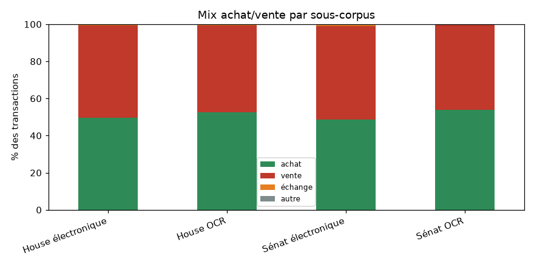
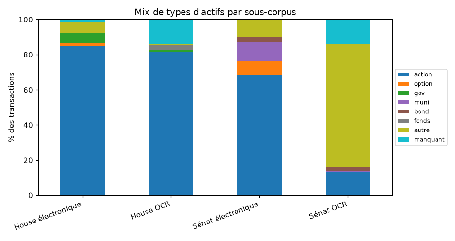
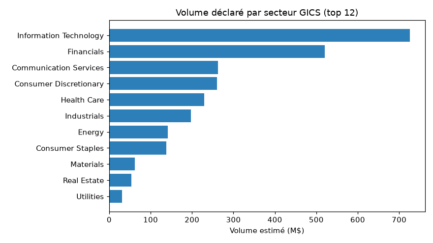
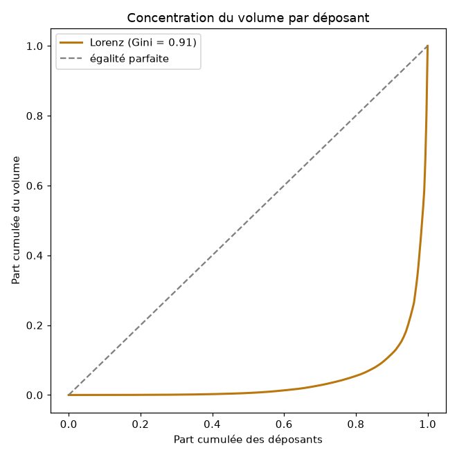
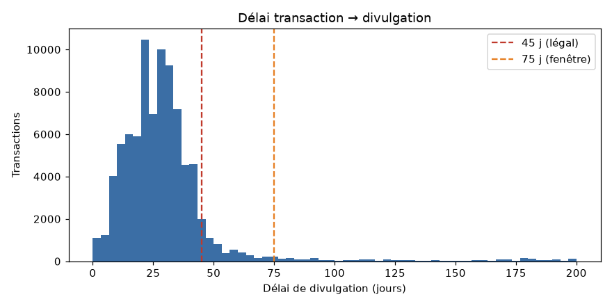
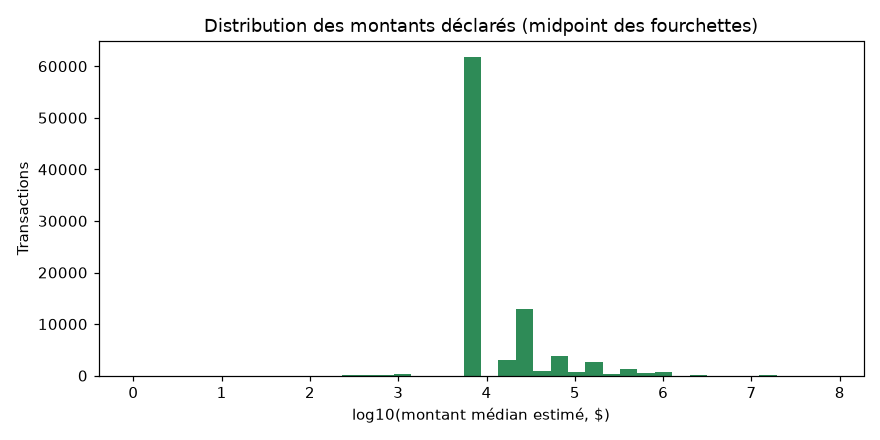
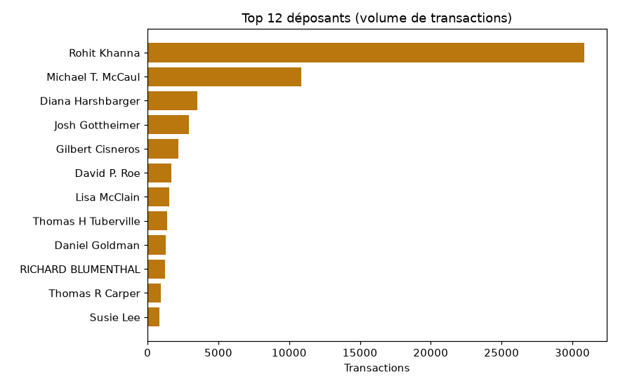
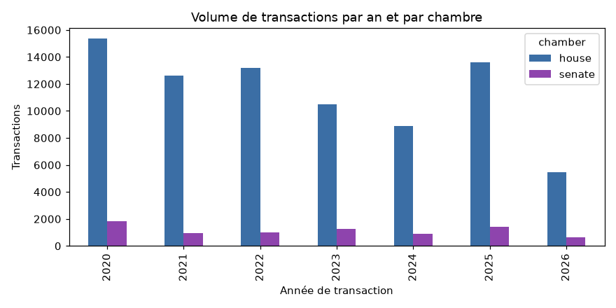

# Rapport qualité — Données de trading du Congrès américain
> Chambre des représentants + Sénat · 2020–2026 · généré par `python -m common.quality` (lecture seule des tables FINAL, aucun appel API) · Quiver Quantitative = vérité-terrain externe, **jamais réinjectée**.

## Résumé exécutif

- **Périmètre** — 89 852 transactions uniques de membres élus (House 81 607 + Sénat 8 245), 2020–2026, en **4 sous-corpus** (chambre × voie d'acquisition : électronique déterministe / scan OCR).
- **Complétude vs Quiver** *(§6)* — dans notre fenêtre, on retrouve **93.8 % (House) / 91.5 % (Sénat)** des trades Quiver au niveau (déposant, ticker, sens). Le **vrai trou coté est minuscule** (22 House / 0 Sénat) ; le reste du résidu est de l'OCR récupérable ou du hors-périmètre.
- **On est plus complet que Quiver** — **+6886 actions cotées qu'on a et que Quiver n'a pas, contre 13 trous inverses.** La base est, en pratique, un **sur-ensemble** de Quiver.
- **Les « écarts » date/ticker ne sont pas des erreurs** — 99.3 % (House) de l'écart-date est un artefact de mesure (même trade tradé plusieurs jours, voir §6.6) ; nos tickers concordent avec la description d'actif.
- **Données propres** — identité rattachée à 100.0 %, dates cohérentes 99.8 %, délai de divulgation médian 28 j, montants renseignés 99.0 %.

*Plan : §1 composition · §2 cohérence des dates · §3 délai légal · §4 montants · §5 couverture & structure · §6 complétude vs Quiver (vérité-terrain).*

## 1. Composition & qualité par sous-corpus

Les déclarations proviennent de **quatre sous-corpus** très différents (chambre × voie d'acquisition). Toute la suite distingue ces quatre familles, car leur qualité et leur composition diffèrent.

| sous-corpus | n | part % |
| --- | --- | --- |
| House électronique | 32667 | 36.4 |
| House OCR | 48940 | 54.5 |
| Sénat électronique | 6566 | 7.3 |
| Sénat OCR | 1679 | 1.9 |

### Couverture des champs enrichis (taux de remplissage)

| sous-corpus | n | ticker % | secteur % | ETF % | commission % | identité % | ancienneté % |
| --- | --- | --- | --- | --- | --- | --- | --- |
| House électronique | 32667 | 88.7 | 86.6 | 86.6 | 74.7 | 100.0 | 100.0 |
| House OCR | 48940 | 83.1 | 81.0 | 81.0 | 94.5 | 100.0 | 100.0 |
| Sénat électronique | 6566 | 79.3 | 71.3 | 71.3 | 62.5 | 100.0 | 100.0 |
| Sénat OCR | 1679 | 33.2 | 19.4 | 19.4 | 96.1 | 100.0 | 100.0 |

`identite_%` = part rattachée à un `bioguide_id` ; `ticker`/`secteur`/`etf_proxy` sont vides pour les actifs non cotés (légitime, pas un défaut).

### Scorecard de qualité

| sous-corpus | n | dates cohérentes % | date plausible % | année aberrante (n) | montant renseigné % |
| --- | --- | --- | --- | --- | --- |
| House électronique | 32667 | 99.9 | — | 0 | 100.0 |
| House OCR | 48940 | 99.7 | 95.4 | 0 | 98.2 |
| Sénat électronique | 6566 | 100.0 | 92.5 | 0 | 100.0 |
| Sénat OCR | 1679 | 99.8 | 98.5 | 0 | 99.6 |

`date_plausible_%` (fenêtre 75 j) n'existe que pour les lignes OCR → « — » pour House électronique (pas de `date_confidence`). `amount_split_flag` est partout `False` (aucune fourchette éclatée).

### Mix par sous-corpus

**Sens des opérations :**

| sous-corpus | n | achat % | vente % | échange % | autre % |
| --- | --- | --- | --- | --- | --- |
| House électronique | 32667 | 49.7 | 49.7 | 0.6 | 0.0 |
| House OCR | 48940 | 52.7 | 46.6 | 0.7 | 0.0 |
| Sénat électronique | 6566 | 48.6 | 50.5 | 0.9 | 0.0 |
| Sénat OCR | 1679 | 54.0 | 45.8 | 0.2 | 0.0 |



**Détenteur déclaré :**

| sous-corpus | n | perso % | conjoint % | joint % | enfant % | autre % |
| --- | --- | --- | --- | --- | --- | --- |
| House électronique | 32667 | 51.9 | 19.7 | 26.2 | 2.2 | 0.0 |
| House OCR | 48940 | 6.7 | 51.1 | 7.0 | 35.2 | 0.0 |
| Sénat électronique | 6566 | 15.7 | 41.4 | 40.1 | 2.9 | 0.0 |
| Sénat OCR | 1679 | 26.9 | 73.0 | 0.1 | 0.1 | 0.0 |

**Familles d'actifs** (le non-coté — oblig. d'État, munis, obligations — domine l'OCR du Sénat) :

| sous-corpus | n | action % | option % | oblig. État % | muni % | oblig. corp. % | fonds % | autre % | manquant % |
| --- | --- | --- | --- | --- | --- | --- | --- | --- | --- |
| House électronique | 32667 | 84.6 | 1.8 | 5.9 | 0.0 | 0.0 | 0.0 | 6.1 | 1.6 |
| House OCR | 48940 | 81.7 | 0.0 | 0.8 | 0.0 | 0.1 | 3.1 | 0.6 | 13.8 |
| Sénat électronique | 6566 | 67.2 | 9.1 | 0.0 | 10.8 | 3.0 | 0.0 | 10.0 | 0.0 |
| Sénat OCR | 1679 | 12.9 | 0.0 | 0.0 | 0.8 | 2.6 | 0.0 | 69.6 | 14.2 |



### Secteurs & sources de résolution

| sous-corpus | n | secteur renseigné % | ETF % | top 3 secteurs |
| --- | --- | --- | --- | --- |
| House électronique | 32667 | 86.6 | 86.6 | Information Technology 20%, Financials 14%, Health Care 13% |
| House OCR | 48940 | 81.0 | 81.0 | Information Technology 20%, Financials 16%, Health Care 14% |
| Sénat électronique | 6566 | 71.3 | 71.3 | Information Technology 22%, Financials 16%, Consumer Discretionary 10% |
| Sénat OCR | 1679 | 19.4 | 19.4 | Financials 21%, Communication Services 18%, Information Technology 12% |

**Origine du ticker** (`ticker_source` ; vide pour House électronique → « — ») :

| sous-corpus | n | dico élec % | LLM % | explicite % | aucune % |
| --- | --- | --- | --- | --- | --- |
| House électronique | 32667 | — | — | — | — |
| House OCR | 48940 | 45.6 | 36.2 | 1.3 | 16.9 |
| Sénat électronique | 6566 | 0.5 | 0.7 | 77.1 | 20.7 |
| Sénat OCR | 1679 | 9.5 | 8.3 | 15.4 | 66.8 |

**Origine du secteur** (`sector_source`) :

| sous-corpus | n | yfinance % | LLM % | manuel % | aucune % |
| --- | --- | --- | --- | --- | --- |
| House électronique | 32667 | 78.7 | 7.8 | 0.2 | 13.3 |
| House OCR | 48940 | 75.4 | 5.6 | 0.1 | 18.9 |
| Sénat électronique | 6566 | 62.1 | 9.0 | 0.9 | 28.0 |
| Sénat OCR | 1679 | 12.0 | 7.4 | 1.1 | 79.5 |



### Montants par sous-corpus

| sous-corpus | n | médiane $ | moyenne $ | P25_$ | P75_$ | P95_$ | volume total M$ |
| --- | --- | --- | --- | --- | --- | --- | --- |
| House électronique | 32667 | 8000 | 53307 | 8000 | 15001 | 100001 | 1741.4 |
| House OCR | 48940 | 8000 | 49627 | 8000 | 32500 | 175000 | 2386.0 |
| Sénat électronique | 6566 | 8000 | 100115 | 8000 | 32500 | 375000 | 657.4 |
| Sénat OCR | 1679 | 32500 | 171021 | 8000 | 75000 | 750000 | 285.9 |

### Concentration de l'activité

| sous-corpus | n déposants | HHI | Gini | top10 volume % |
| --- | --- | --- | --- | --- |
| House électronique | 234 | 662.7 | 0.877 | 68.8 |
| House OCR | 40 | 2888.3 | 0.913 | 98.7 |
| Sénat électronique | 61 | 1269.1 | 0.835 | 84.6 |
| Sénat OCR | 5 | 6388.7 | 0.695 | 100.0 |

`HHI` ∈ [0, 10000] et `Gini` ∈ [0, 1] mesurent la concentration du volume par déposant (plus c'est haut, plus quelques déposants dominent).



**Top tickers par volume estimé :**

| ticker | n trades | volume M$ |
| --- | --- | --- |
| MSFT | 1011 | 261.3 |
| ICE | 110 | 93.4 |
| BRP | 7 | 81.8 |
| AAPL | 739 | 80.4 |
| MET | 114 | 76.2 |
| T | 338 | 63.1 |
| NVDA | 594 | 46.1 |
| DFS | 66 | 42.9 |
| AMZN | 684 | 42.3 |
| HBI | 65 | 38.3 |
| GOOGL | 599 | 29.8 |
| ADBE | 381 | 23.2 |
| AVGO | 269 | 18.1 |
| PYPL | 355 | 17.0 |
| AESI | 5 | 15.9 |

**Volume par secteur GICS :**

| secteur | n trades | volume M$ |
| --- | --- | --- |
| Information Technology | 14315 | 725.9 |
| Financials | 10981 | 520.7 |
| Communication Services | 5593 | 263.1 |
| Consumer Discretionary | 8309 | 259.7 |
| Health Care | 9495 | 229.7 |
| Industrials | 8476 | 196.8 |
| Energy | 3077 | 141.5 |
| Consumer Staples | 5137 | 138.5 |
| Materials | 2898 | 61.8 |
| Real Estate | 2729 | 53.6 |
| Utilities | 1274 | 30.5 |

### Profil des clusters de scan (House OCR)

| cluster | n lignes | n docs | date plausible % | ticker % | Quiver a le trade % |
| --- | --- | --- | --- | --- | --- |
| A_tape_droit | 5957 | 59 | 99.6 | 84.2 | 88.0 |
| B_tape_tourne | 42125 | 295 | 94.7 | 82.9 | 77.9 |
| C_manuscrit | 858 | 80 | 97.4 | 88.5 | 35.3 |

A = tapé droit, B = tapé tourné, C = manuscrit. L'appariement Quiver (`Quiver a le trade %`) **chute** sur le manuscrit alors qu'il reste élevé sur le tapé (voir colonne) : c'est notre lecture OCR des dates manuscrites qui décroche, pas la plausibilité interne (`date plausible %`, fenêtre 75 j, reste haute). D'où l'exclusion par défaut du cluster C.

## 2. Cohérence des dates (`disclosure_date ≥ transaction_date`)
| chambre | n | dates exploitables % | cohérentes % | incohérentes | année aberrante | date manquante |
| --- | --- | --- | --- | --- | --- | --- |
| house | 81607 | 99.8 | 99.8 | 159 | 0 | 178 |
| senate | 8245 | 99.9 | 100.0 | 3 | 0 | 7 |

**Par sous-corpus :**

| sous-corpus | n | dates exploitables % | cohérentes % | incohérentes | année aberrante | date manquante |
| --- | --- | --- | --- | --- | --- | --- |
| House électronique | 32667 | 100.0 | 99.9 | 18 | 0 | 0 |
| House OCR | 48940 | 99.6 | 99.7 | 141 | 0 | 178 |
| Sénat électronique | 6566 | 100.0 | 100.0 | 0 | 0 | 0 |
| Sénat OCR | 1679 | 99.6 | 99.8 | 3 | 0 | 7 |

Lecture : `dates_parseables_pct` mesure les dates exploitables (le reste = OCR papier illisible) ; `coherentes_pct` = part où la divulgation suit bien la transaction. Les `incoherentes` sont surtout des divulgations amendées/antidatées réelles ; `annee_txn_implausible` isole les rares erreurs OCR de lecture d'année (année de transaction postérieure au dépôt ou antérieure à 2012), déjà incluses dans les incohérentes. Des transactions 2013–2019 apparaissent légitimement (divulgations très tardives).

## 3. Délai légal de divulgation (STOCK Act ~45 j)
| chambre | n dates valides | ≤45j légal % | 45–75j % | >75j % | négatif % | délai médian (j) |
| --- | --- | --- | --- | --- | --- | --- |
| house | 81429 | 87.0 | 5.2 | 7.7 | 0.2 | 28 |
| senate | 8238 | 91.0 | 2.8 | 6.2 | 0.0 | 27 |

**Par sous-corpus :**

| sous-corpus | n dates valides | ≤45j légal % | 45–75j % | >75j % | négatif % | délai médian (j) |
| --- | --- | --- | --- | --- | --- | --- |
| House électronique | 32667 | 81.9 | 4.9 | 13.2 | 0.1 | 28 |
| House OCR | 48762 | 90.3 | 5.4 | 4.0 | 0.3 | 28 |
| Sénat électronique | 6566 | 90.6 | 1.9 | 7.5 | 0.0 | 26 |
| Sénat OCR | 1672 | 92.4 | 6.5 | 0.9 | 0.2 | 29 |



Le pipeline tolère une fenêtre de 75 j (`date_confidence`) ; le tableau isole la part strictement dans les **45 j légaux** vs la marge 45–75 j vs les retards >75 j.

**Divulgations les plus tardives (> 365 j, suspects) :**

| déposant | chambre | date txn | date divulg. | délai (j) | ticker | opération |
| --- | --- | --- | --- | --- | --- | --- |
| Jefferson Shreve | house | 2015-05-08 | 2025-06-22 | 3698.0 | DHR | Purchase |
| Jefferson Shreve | house | 2015-05-08 | 2025-06-22 | 3698.0 | DAL | Purchase |
| Richard W. Allen | house | 2017-02-03 | 2023-08-10 | 2379.0 |  | Purchase |
| Richard W. Allen | house | 2017-02-13 | 2023-08-10 | 2369.0 | O | Sale |
| Richard W. Allen | house | 2017-03-23 | 2023-08-10 | 2331.0 | BBT | Sale |
| Richard W. Allen | house | 2017-03-23 | 2023-08-10 | 2331.0 | BBT | Sale (Partial) |
| Richard W. Allen | house | 2017-04-27 | 2023-08-10 | 2296.0 | XOM | Sale |
| Richard W. Allen | house | 2017-04-27 | 2023-08-10 | 2296.0 | COST | Purchase |
| Richard W. Allen | house | 2017-05-16 | 2023-08-10 | 2277.0 | GE | Sale |
| Richard W. Allen | house | 2017-05-16 | 2023-08-10 | 2277.0 | FDX | Purchase |
| Thomas Suozzi | house | 2017-01-05 | 2022-12-19 | 2174.0 | PCLN | Sale |
| Thomas Suozzi | house | 2017-01-05 | 2022-12-19 | 2174.0 | DFS | Sale |
| Thomas Suozzi | house | 2017-01-05 | 2022-12-19 | 2174.0 | CME | Sale |
| Thomas Suozzi | house | 2017-01-05 | 2022-12-19 | 2174.0 | FB | Sale |
| Thomas Suozzi | house | 2017-01-05 | 2022-12-19 | 2174.0 | KMX | Sale |

## 4. Distribution des montants (`amount_midpoint`)

Stats globales (USD, midpoint des fourchettes déclarées) :

```
count       88982.0
mean        56985.0
std        595298.0
min             1.0
25%          8000.0
50%          8000.0
75%         32500.0
90%         75000.0
max      75000000.0
```

Par chambre :

```
           count      mean       std     min     25%     50%      75%         max
chamber                                                                          
house    80744.0   51116.0  569184.0     1.0  8000.0  8000.0  32500.0  75000000.0
senate    8238.0  114506.0  805522.0  8000.0  8000.0  8000.0  32500.0  50000000.0
```

Par sous-corpus :

```
                      count      mean        std     min     25%      50%      75%         max
corpus                                                                                        
House électronique  32667.0   53307.0   522013.0     1.0  8000.0   8000.0  15001.0  37500000.0
House OCR           48077.0   49628.0   599121.0  8000.0  8000.0   8000.0  32500.0  75000000.0
Sénat électronique   6566.0  100115.0   632303.0  8000.0  8000.0   8000.0  32500.0  15000000.0
Sénat OCR            1672.0  171021.0  1274262.0  8000.0  8000.0  32500.0  75000.0  50000000.0
```



**Top 15 déposants par volume estimé (Σ midpoint) :**

| déposant | chambre | n trades | volume estimé M$ |
| --- | --- | --- | --- |
| Michael T. McCaul | house | 10738 | 974.5 |
| Rohit Khanna | house | 30516 | 667.8 |
| Diana Harshbarger | house | 3124 | 464.5 |
| Darrell E. Issa | house | 20 | 250.5 |
| RICHARD BLUMENTHAL | senate | 1226 | 221.3 |
| Josh Gottheimer | house | 2942 | 209.4 |
| Jefferson Shreve | house | 631 | 191.7 |
| Scott Franklin | house | 68 | 182.1 |
| Rick Scott | senate | 266 | 167.2 |
| Nancy Pelosi | house | 147 | 139.6 |
| Suzan K. DelBene | house | 406 | 125.9 |
| Kelly Loeffler | senate | 329 | 120.9 |
| David H McCormick | senate | 293 | 69.0 |
| Scott H. Peters | house | 334 | 64.6 |
| Kevin Hern | house | 760 | 60.1 |

## 5. Couverture par déposant & structure de l'activité

320 déposants distincts. **206** ont ≥ 10 transactions (éligibles au backtest), dont **150** actifs sur ≥ 3 années.





**Top 20 déposants (transactions, OCR%, années actives) :**

| nom | total | dont OCR | OCR % | n années | 1re année | dern. année |
| --- | --- | --- | --- | --- | --- | --- |
| Rohit Khanna | 30862 | 30862 | 100 | 8 | 2019 | 2026 |
| Michael T. McCaul | 10850 | 10850 | 100 | 7 | 2020 | 2026 |
| Diana Harshbarger | 3515 | 3514 | 100 | 4 | 2021 | 2026 |
| Josh Gottheimer | 2942 | 0 | 0 | 8 | 2019 | 2026 |
| Gilbert Cisneros | 2153 | 0 | 0 | 4 | 2019 | 2026 |
| David P. Roe | 1686 | 1686 | 100 | 1 | 2020 | 2020 |
| Lisa McClain | 1532 | 109 | 7 | 3 | 2024 | 2026 |
| Thomas H Tuberville | 1369 | 0 | 0 | 5 | 2021 | 2025 |
| Daniel Goldman | 1291 | 0 | 0 | 2 | 2023 | 2025 |
| RICHARD BLUMENTHAL | 1232 | 1232 | 100 | 8 | 2019 | 2026 |
| Thomas R Carper | 923 | 0 | 0 | 6 | 2019 | 2024 |
| Susie Lee | 857 | 0 | 0 | 8 | 2019 | 2026 |
| Donald Sternoff Beyer | 822 | 0 | 0 | 8 | 2019 | 2026 |
| Kathy Manning | 803 | 0 | 0 | 5 | 2021 | 2025 |
| JOHN BOOZMAN | 768 | 379 | 49 | 8 | 2019 | 2026 |
| Thomas Suozzi | 765 | 20 | 3 | 9 | 2017 | 2026 |
| Kevin Hern | 760 | 0 | 0 | 8 | 2019 | 2026 |
| Alan S. Lowenthal | 676 | 0 | 0 | 4 | 2019 | 2022 |
| Lois Frankel | 656 | 0 | 0 | 5 | 2019 | 2023 |
| Mark Green | 653 | 0 | 0 | 6 | 2020 | 2025 |

### Achats sans sortie déclarée (pour la stratégie)

Achats (avec ticker) sans vente ultérieure déclarée par le même membre sur le même ticker → positions qui seraient fermées de force à +12 mois dans la stratégie.

| chambre | achats (avec ticker) | avec sortie | sans sortie % |
| --- | --- | --- | --- |
| house | 34562 | 26783 | 22.5 |
| senate | 2468 | 1502 | 39.1 |

**Par sous-corpus :**

| sous-corpus | achats (avec ticker) | avec sortie | sans sortie % |
| --- | --- | --- | --- |
| House électronique | 14010 | 8288 | 40.8 |
| House OCR | 20552 | 18495 | 10.0 |
| Sénat électronique | 2301 | 1373 | 40.3 |
| Sénat OCR | 167 | 129 | 22.8 |

## 6. Complétude vs Quiver (vérité-terrain externe)

> **Section clé.** On liste tous les trades Quiver de notre fenêtre, on les confronte aux nôtres, et on montre qu'ils y sont **inclus** (Quiver ⊆ nous) — qu'on est même **plus complet** — puis pourquoi les « écarts » de date ne sont pas des erreurs. Chiffres recalculés par `common/quiver_diagnosis.py`, **jamais réinjectés**.

### 6.1 Méthode d'appariement

Chaque transaction est confrontée à Quiver par une clé normalisée, sur **deux mesures** : l'**inclusion** (a-t-on le trade) et l'**exact-date** (même trade, même date).

| élément | définition |
| --- | --- |
| univers comparé | tous les trades Quiver `Filed` ∈ 2020–2026 (notre fenêtre de scrape) |
| clé d'appariement | (`bioguide`, ticker normalisé, date, sens) — sans la date pour l'inclusion |
| normalisation ticker | MAJ + trim ; rejette {vide, NAN, NONE, --} ; retire ` PUT`/` CALL` ; `.`/`-` → `_` |
| normalisation sens | 1re lettre p/s/e → Purchase / Sale / Exchange |
| mesure 1 — inclusion | clé SANS date → « a-t-on tout ce que Quiver a » (la vraie complétude) |
| mesure 2 — exact-date | clé AVEC date → compte raté tout décalage de date (artefact, §6.5) |

*Réf. : `house/quiver.py` (`norm_ticker`, `norm_sense`), `common/quiver_diagnosis.py`.*

### 6.2 Réconciliation du corpus

Le FINAL est dédupliqué cross-année avant comparaison (une re-divulgation tardive ne compte qu'une fois) :

| chambre | lignes brutes | re-divulgations (dédup) | transactions uniques |
| --- | --- | --- | --- |
| house | 81642 | 35 | 81607 |
| senate | 8841 | 596 | 8245 |
| TOTAL | 90483 | 631 | 89852 |
### 6.3 Inclusion : a-t-on tout ce que Quiver a ? (Quiver ⊆ nous)

Dans notre fenêtre, on retrouve **93.8 % (House)** et **91.5 % (Sénat)** des trades Quiver au niveau (déposant, ticker, sens). Le **vrai trou coté** est minuscule (22 House / 0 Sénat) ; le reste du résidu est récupérable ou hors périmètre :

| chambre | trades Quiver (fenêtre) | qu'on a | inclusion % | résidu | dont OCR récup. | dont non-coté | dont 2-jambes | dont autre chambre | vrai trou coté |
| --- | --- | --- | --- | --- | --- | --- | --- | --- | --- |
| house | 17481 | 16397 | 93.8 | 1084 | 974 | 88 | 0 | 0 | 22 |
| senate | 2587 | 2366 | 91.5 | 221 | 0 | 0 | 21 | 200 | 0 |

*Légende du résidu :* **OCR récup.** = lignes papier ratées (re-OCR ciblé) · **non-coté** = « ticker » Quiver non appariable (CUSIP, préférentielle, fragment) · **2-jambes** = on a le trade sous un ticker d'échange (« PFE  VTRS » couvre « PFE ») · **autre chambre** = déposant Rep→Sén dont les trades Chambre polluent le cache Sénat de Quiver · **vrai trou coté** = le seul manque réel.

### 6.4 On est plus complet que Quiver (bilan net)

Actions cotées qu'on a et que Quiver n'a PAS (`on_a_en_plus`) vs vrais trous inverses (`vrais_trous`) :

| chambre | actions qu'on a en + | vrais trous | solde net |
| --- | --- | --- | --- |
| house | 6206 | 10 | 6196 |
| senate | 680 | 3 | 677 |
### 6.5 Pourquoi l'exact-date sous-compte (artefact de collision)

Quand un déposant trade le même ticker plusieurs jours, l'exact-date n'apparie qu'une fraction des trades réels : **99.3 % (House)** de l'écart-date est cet artefact, pas une erreur.

| chambre | écart-date | dont collision | collision % | isolés (vrai écart possible) |
| --- | --- | --- | --- | --- |
| house | 13197 | 13102 | 99.3 | 95 |
| senate | 329 | 328 | 99.7 | 1 |

**Exemple concret (régénéré)** — même (déposant, ticker, sens) tradé de nombreux jours ; nos dates ≈ celles de Quiver, mais le moindre décalage compte comme « raté » :

| chambre | déposant | ticker | sens | nos dates (n) | dates Quiver (n) | exemple nos dates | exemple dates Quiver |
| --- | --- | --- | --- | --- | --- | --- | --- |
| house | Rohit Khanna | DIS | Purchase | 101 | 62 | 2020-01-08/2020-02-11/2020-02-13/2020-02-26 | 2020-01-08/2020-02-11/2020-02-12/2020-02-26 |
| senate | Thomas H Tuberville | CLF | Sale | 29 | 29 | 2021-01-21/2021-03-12/2021-04-19/2021-07-19 | 2021-01-21/2021-03-12/2021-04-19/2021-07-19 |
### 6.6 Écarts de date isolés : qui a raison ?

Les seuls vrais écarts possibles sont les cas **isolés** (hors collision) : 95 House / 1 Sénat. La colonne `delta (j)` tranche : un delta pluriannuel = Quiver a un **vieux trade sans rapport** (pas notre erreur). `doc_id` = pièce consultable.

| chambre | provenance | déposant | ticker | sens | notre date | date Quiver | delta (j) | doc_id |
| --- | --- | --- | --- | --- | --- | --- | --- | --- |
| house | house-pdf-ocr | Rohit Khanna | LNT | Purchase | 2026-01-29 | 2018-01-02 | 2949.0 | 8221322 |
| house | house-pdf-electronic | Pete Sessions | IBM | Purchase | 2021-04-30 | 2013-04-22 | 2930.0 | 20018672 |
| house | house-pdf-ocr | Rohit Khanna | CSL | Purchase | 2022-11-03 | 2017-11-30 | 1799.0 | 8219288 |
| house | house-pdf-electronic | John A. Yarmuth | AMGN | Purchase | 2020-05-29 | 2016-02-01 | 1579.0 | 20019291 |
| house | house-pdf-ocr | Rohit Khanna | ADM | Exchange | 2026-05-27 | 2022-04-17 | 1501.0 | 9116142 |
| house | house-pdf-ocr | Rohit Khanna | TSM | Exchange | 2025-11-14 | 2021-11-02 | 1473.0 | 8221264 |
| house | house-pdf-ocr | Rohit Khanna | IONS | Purchase | 2022-04-13 | 2018-04-03 | 1471.0 | 8218730 |
| house | house-pdf-ocr | Rohit Khanna | SYK | Exchange | 2025-08-04 | 2021-11-02 | 1371.0 | 9115676 |
| house | house-pdf-ocr | Rohit Khanna | GM | Exchange | 2020-06-18 | 2024-02-20 | -1342.0 | 8217394 |
| house | house-pdf-ocr | Rohit Khanna | JPM | Exchange | 2022-09-08 | 2019-02-05 | 1311.0 | 8219242 |
| house | house-pdf-ocr | Rohit Khanna | UTHR | Sale | 2021-11-09 | 2018-05-08 | 1281.0 | 8218490 |
| house | house-pdf-ocr | Rohit Khanna | LTRPA | Purchase | 2021-08-17 | 2018-04-03 | 1232.0 | 8218338 |

*(Top 12 par |delta| ; les 96 cas sont dans `quiver_validation/ecarts_date_isoles.csv`.)*

### 6.7 Détail figé : couverture exact-date par scope, type d'actif, cluster

Vue d'ensemble **exact-date** (tables figées 07c/07g/07h ; sous-compte par construction, cf. §6.5). `couverture %` = part des trades Quiver retrouvés à la date exacte.

**Couverture par scope et chambre :**

| chambre | scope | appariés | Quiver | nous seul | Quiver seul | couverture % |
| --- | --- | --- | --- | --- | --- | --- |
| house | both | 43279.0 | 50221.0 | 13482.0 | 6942.0 | 86.2 |
| house | digital | 25784.0 | 26252.0 | 415.0 | 468.0 | 98.2 |
| house | ocr | 17583.0 | 25743.0 | 13067.0 | 8160.0 | 68.3 |
| senate | both | 4324.0 | 4349.0 | 544.0 | 25.0 | 99.4 |
| senate | digital | 4324.0 | 4349.0 | 405.0 | 25.0 | 99.4 |
| senate | ocr | 0.0 | 15.0 | 64.0 | 15.0 | 0.0 |

**Par type d'actif** (`non-coté` = muni/obligation, hors périmètre Quiver-actions) — **House :**

| type d'actif | exact (date) | date ≠ | absent | non-coté | total | Quiver a le trade % |
| --- | --- | --- | --- | --- | --- | --- |
| Stock | 47475 | 9301 | 8105 | 2796 | 67677 | 87.5 |
| (inconnu) | 1704 | 211 | 1015 | 4345 | 7275 | 65.4 |
| Gov Security | 5 | 0 | 23 | 2259 | 2287 | 17.9 |
| Mutual Fund | 130 | 92 | 715 | 575 | 1512 | 23.7 |
| Other | 161 | 14 | 7 | 810 | 992 | 96.2 |
| CS | 56 | 1 | 1 | 724 | 782 | 98.3 |
| Option | 492 | 7 | 83 | 0 | 582 | 85.7 |
| HN | 5 | 0 | 0 | 134 | 139 | 100.0 |
| PS | 6 | 0 | 0 | 103 | 109 | 100.0 |
| Other Investment | 2 | 0 | 0 | 61 | 63 | 100.0 |
| CT | 5 | 0 | 0 | 52 | 57 | 100.0 |
| VA | 0 | 0 | 0 | 40 | 40 |  |
| AB | 14 | 0 | 1 | 24 | 39 | 93.3 |
| Corporate Bond | 3 | 2 | 0 | 32 | 37 | 100.0 |
| OL | 5 | 0 | 0 | 28 | 33 | 100.0 |
| ET | 16 | 0 | 0 | 0 | 16 | 100.0 |
| RS | 1 | 1 | 0 | 1 | 3 | 100.0 |
| SA | 1 | 0 | 0 | 2 | 3 | 100.0 |

— **Sénat** (l'OCR y est surtout du non-coté) :

| type d'actif | exact (date) | date ≠ | absent | non-coté | total | Quiver a le trade % |
| --- | --- | --- | --- | --- | --- | --- |
| Stock | 4071 | 105 | 783 | 68 | 5027 | 84.2 |
| Other | 350 | 21 | 158 | 1283 | 1812 | 70.1 |
| Municipal Security | 0 | 4 | 7 | 755 | 766 | 36.4 |
| Option | 421 | 10 | 23 | 63 | 517 | 94.9 |
| Corporate Bond | 1 | 3 | 54 | 188 | 246 | 6.9 |
| (inconnu) | 0 | 8 | 206 | 25 | 239 | 3.7 |
| Commodities/Futures Contract | 0 | 0 | 0 | 87 | 87 |  |
| Stock Option | 75 | 0 | 2 | 3 | 80 | 97.4 |
| Non-Public Stock | 0 | 0 | 2 | 58 | 60 | 0.0 |
| Cryptocurrency | 4 | 0 | 2 | 1 | 7 | 66.7 |

**Par cluster de scan (House)** — Quiver A le papier (`Quiver a le trade %` reste élevé), seule la part exact-date chute sur le manuscrit (lecture OCR des dates) :

| cluster | exact (date) | date ≠ | absent | non-coté | total | Quiver a le trade % |
| --- | --- | --- | --- | --- | --- | --- |
| B_tape_tourne | 18558 | 8653 | 7706 | 7234 | 42151 | 77.9 |
| A_tape_droit | 3784 | 630 | 600 | 943 | 5957 | 88.0 |
| C_manuscrit | 100 | 169 | 493 | 100 | 862 | 35.3 |

### 6.8 Verdicts détaillés

Chaque transaction reçoit un verdict (côté nous et côté Quiver). `ecart_brut_pct` (`ECART_DATE`+`ECART_TICKER`) **n'est PAS un taux d'erreur** : l'écart-date est l'artefact du §6.5, et nos tickers concordent avec la description d'actif.

**Synthèse côté NOUS** (part de NOS transactions par catégorie) :

| chambre | nos txns | concordant % | écart brut % | structurel % | on est + complet % |
| --- | --- | --- | --- | --- | --- |
| house | 81607 | 61.4 | 18.6 | 12.4 | 7.6 |
| senate | 8245 | 59.7 | 2.1 | 30.0 | 8.2 |

**Verdicts nous→Quiver :**

| côté | verdict | n | % | à corriger |
| --- | --- | --- | --- | --- |
| nous→Quiver (house) | CONCORDANT | 50074 | 61.4 | False |
| nous→Quiver (house) | ECART_DATE | 9629 | 11.8 | True |
| nous→Quiver (house) | ECART_TICKER | 5539 | 6.8 | True |
| nous→Quiver (house) | STRUCTUREL | 10159 | 12.4 | False |
| nous→Quiver (house) | ON_EST_PLUS_COMPLET | 6206 | 7.6 | False |
| nous→Quiver (senate) | CONCORDANT | 4922 | 59.7 | False |
| nous→Quiver (senate) | ECART_DATE | 100 | 1.2 | True |
| nous→Quiver (senate) | ECART_TICKER | 71 | 0.9 | True |
| nous→Quiver (senate) | STRUCTUREL | 2472 | 30.0 | False |
| nous→Quiver (senate) | ON_EST_PLUS_COMPLET | 680 | 8.2 | False |

**Verdicts Quiver→nous** (`only_quiver`) — `NOTRE_MANQUE` = le seul vrai trou coté (résiduel après filtrage du non-coté), les autres s'expliquent par la date, le ticker, ou du papier :

| côté | verdict | n | % | à corriger |
| --- | --- | --- | --- | --- |
| Quiver→nous (house) | ECART_DATE | 3419 | 49.2 | True |
| Quiver→nous (house) | ECART_TICKER | 2317 | 33.4 | True |
| Quiver→nous (house) | MANQUANT_PAPIER | 1066 | 15.4 | True |
| Quiver→nous (house) | NON_COTE | 132 | 1.9 | False |
| Quiver→nous (house) | NOTRE_MANQUE | 10 | 0.1 | True |
| Quiver→nous (senate) | ECART_TICKER | 22 | 88.0 | True |
| Quiver→nous (senate) | NOTRE_MANQUE | 3 | 12.0 | True |

**Couverture (Quiver→nous) et precision (nous→Quiver) par année** (scope `both`) :

| chambre | année | appariés | Quiver | couverture % | precision % |
| --- | --- | --- | --- | --- | --- |
| house | 2020 | 7115 | 8359 | 85.1 | 75.0 |
| house | 2021 | 5222 | 5893 | 88.6 | 63.2 |
| house | 2022 | 6075 | 7513 | 80.9 | 60.2 |
| house | 2023 | 6128 | 7567 | 81.0 | 84.7 |
| house | 2024 | 4670 | 5442 | 85.8 | 79.7 |
| house | 2025 | 9836 | 10773 | 91.3 | 90.8 |
| house | 2026 | 4233 | 4674 | 90.6 | 84.9 |
| senate | 2020 | 1251 | 1259 | 99.4 | 93.6 |
| senate | 2021 | 398 | 406 | 98.0 | 64.1 |
| senate | 2022 | 636 | 640 | 99.4 | 96.1 |
| senate | 2023 | 682 | 684 | 99.7 | 88.2 |
| senate | 2024 | 558 | 560 | 99.6 | 97.7 |
| senate | 2025 | 520 | 521 | 99.8 | 88.0 |
| senate | 2026 | 279 | 279 | 100.0 | 89.1 |

**Accord sur les trades qu'on a TOUS LES DEUX** (cellules bio×ticker×date, par appartenance ensembliste) — un désaccord = vraie erreur d'extraction, typée dans `desaccord_champ_*.csv` :

| chambre | n paires | accord sens % | accord montant % |
| --- | --- | --- | --- |
| house | 52258 | 95.8 | 93.1 |
| senate | 4932 | 99.8 | 99.7 |

**Top déposants `NOTRE_MANQUE`** (les rares vrais trous, à investiguer) :

| chambre | bioguide | nom | n trous |
| --- | --- | --- | --- |
| house | B001327 | Rob Bresnahan | 5 |
| house | P000197 | Nancy Pelosi | 2 |
| house | J000307 | John James | 1 |
| house | S000168 | Maria Elvira Salazar | 1 |
| house | W000797 | Debbie Wasserman Schultz | 1 |
| senate | M001198 | Roger W Marshall | 3 |

Listes actionnables complètes (ligne à ligne) → `docs/quiver_validation/` (`ecart_ticker_*`, `notre_manque_*`, `manquant_papier_*`, `desaccord_champ_*` [typé], `on_est_plus_complet_*`, `quiver_non_cote_*`, `ecarts_date_isoles`, `exemple_collision`). Hors golden.

